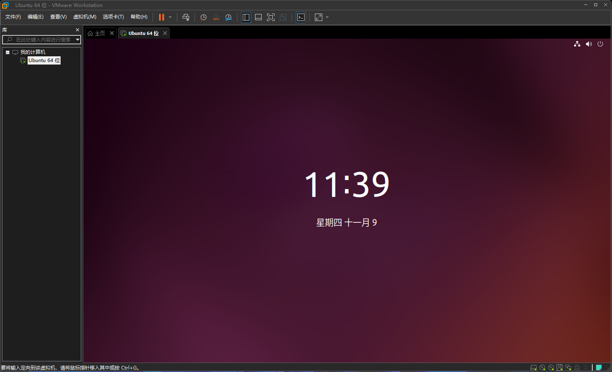

## 前言

很久没有写教程了。
其实日常写的东西并不少，但是我的博客还是断更了，距离上次写内容一个月以上了，这一个月的生活变化、人际关系变化特别多，总的来说：一切在客观上更加顺利了。
写下这篇教程的时间，我有非常多的想法，但是要把想法落地落实，却又需要很多的时间和精力，本着尽量留下痕迹的方式，如果要写就尽量留下公开的痕迹吧，本着这样的思路写下这篇php网站的部署博客。

## 环境部署

第一步是安装ubuntu，有一个可以部署应用的系统。由于本文撰写的时间，我选择了ubuntu 22.04(友人推荐的长期支持版)，至于ubuntu的安装这里不在赘述。



### 设置swap

新的机器，最好设置一下swap防止内存不足，我的机器是2g，设置4g的交换空间应该就足够了。
相关脚本如下：

``` bash
sudo swapon --show #查看是否设置了交换空间
sudo fallocate -l 2G swapfile #创建交换文件
# sudo dd if=/dev/zero of=/swapfile bs=1G count=2 #fallocate不可用时采用这个命令
sudo chmod 600 swapfile #设置文件权限
sudo mkswap swapfile #创建交换文件
sudo swapon swapfile #启用交换文件
echo "/swapfile none swap sw 0 0" | sudo tee -a /etc/fstab #添加内容到启动项中
free -h #检查是否成功
```

我的系统是使用虚拟机安装的，一开始就被设置好了交换分区了。


### 安装docker

第一步，肯定是安装docker，虽然整个网站是使用的php，不过，数据库最好还是容器化比较简单，安装docker按照教程来就可以。[Install Docker Engine on Ubuntu](https://docs.docker.com/engine/install/ubuntu/),这是安装教程链接，使用过多次，每次都很顺利。

卸载旧版本：这个命令是卸载旧版本用的，如果没有安装旧版本，可以不用这个。

``` bash
for pkg in docker.io docker-doc docker-compose docker-compose-v2 podman-docker containerd runc; do sudo apt-get remove $pkg; done
```

设置docker的库,设置好docker软件库，为下载做准备

``` bash
sudo apt-get update
sudo apt-get install ca-certificates curl gnupg
sudo install -m 0755 -d /etc/apt/keyrings
curl -fsSL https://download.docker.com/linux/ubuntu/gpg | sudo gpg --dearmor -o /etc/apt/keyrings/docker.gpg
sudo chmod a+r /etc/apt/keyrings/docker.gpg

# Add the repository to Apt sources:
echo \
  "deb [arch="$(dpkg --print-architecture)" signed-by=/etc/apt/keyrings/docker.gpg] https://download.docker.com/linux/ubuntu \
  "$(. /etc/os-release && echo "$VERSION_CODENAME")" stable" | \
  sudo tee /etc/apt/sources.list.d/docker.list > /dev/null
sudo apt-get update
```

安装docker,并进行测试安装效果

``` bash
sudo apt-get install docker-ce docker-ce-cli containerd.io docker-buildx-plugin docker-compose-plugin

sudo docker run hello-world
```

### 安装openoffice

最好给openoffice单独建立一个目录，这样使用compose可以直接部署openoffice服务。
使用docker compose来部署openoffice服务

``` yaml
version: "3"

services:

  onlyoffice:
    container_name: oo7
    image: onlyoffice/documentserver:7.4.1.1
    ports:
      - "9000:80"
    restart: always
    environment:
      - JWT_SECRET=<yourkey>
```

当然可以使用命令解决以上问题：**！！！注意，yourkey需要修改！！！**

``` bash
mkdir -p ~/workspace/onlyoffice
cat <<EOF | tee ~/workspace/onlyoffice/docker-compose.yaml
version: "3"

services:

  onlyoffice:
    container_name: oo7
    image: onlyoffice/documentserver:7.4.1.1
    ports:
      - "9000:80"
    restart: always
    environment:
      - JWT_SECRET=<yourkey>
EOF

sudo docker compose up -d #下载镜像，启动服务
```

如果想停止服务，可以使用一下命令 ``` sudo docker compose down ```

[http://localhost:9000](http://localhost:9000),可以通过这个网址查看是不是部署成功了。

onlyoffice的镜像可能很大，可以把镜像提前准备好来节省实际部署时候的时间.

``` bash
sudo docker images #这个命令查看镜像，找到要导出镜像的id
sudo docker save 0fdf2b4c26d3 > oo7.tar #导出镜像文件，其中参数就是镜像id
sudo docker load < oo7.tar #导入镜像
```


这里还有一个细节：下载好的镜像，可以放在一个公开的服务器上（比如放到对象存储上），这样用wget下载速度就快了。例子：```wget https://www.example.com/directlink/bj/webs/oo7.tar```

这里的细节其实很多，因为虚拟机是NAT模式联网，我通过web界面把文件上传到了服务器上。这时候发现如果我当初安装的server版，没有gui，那么这个工作还非常难以实现呢。虽然就算有GUI，也是因为我有自己的文件中转服务才能简单实现。


### 部署php环境

然后就是部署php环境的阶段，虽然按照正常流程是php、mysql、nginx这样依次安装，但是这样效率太低了，这里还是推荐用docker安装：

[https://github.com/ogenes/docker-lnmp](https://github.com/ogenes/docker-lnmp)
根据教程就可以部署php网站了。

## 鸣谢

特别鸣谢我的妻子，她帮我写了一个小的手册文章，所以我有时间精力写下这篇教程。
