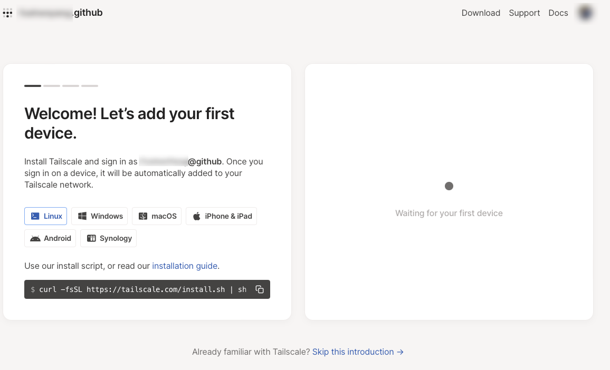
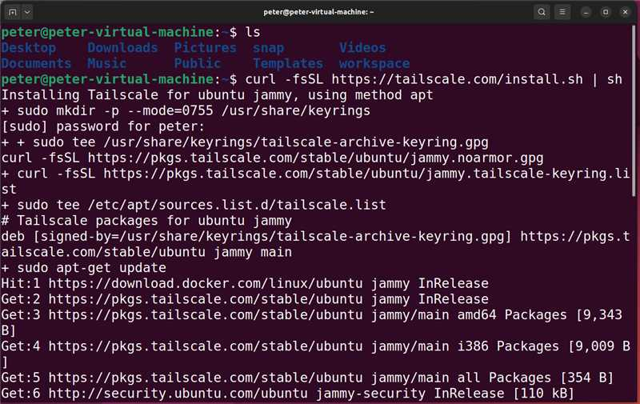
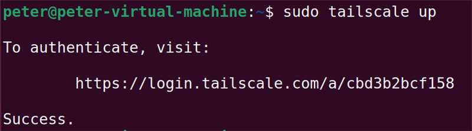
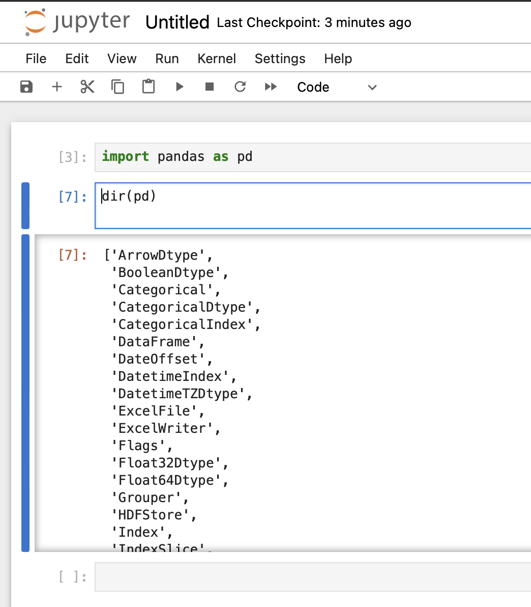
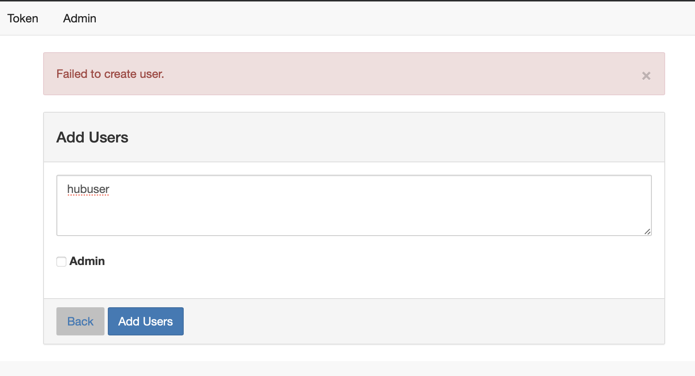

## 前言

python统一环境从来都是一个复杂的问题，特别是要多人合作的时候（甚至两个人合作要统一环境也经常出问题）。环境配置不一致很容易打击团队的积极性，让本来应该聚焦到具体问题解决上的注意力被分散。晚上有很多教程，都是只是讲某个技术细节的配置，很少有完整的方案。本教程详细介绍一下如何配置一个帮助管理员或者小组领导带领小队完成数据分析任务的jupyterhub环境，包括环境安装、用户配置等诸多细节。

## 内网穿透

是的，从内网穿透开始讲，太多的教程都会忽略服务最终如何访问到的问题，好像所有人都有了很好的网络环境，实际上的情况往往很复杂，很多新手可能就被“卡”在这里。当然，本教程也忽略了操作系统的安装这个步骤，尽量做到取舍有度。

假设你已经有了一台可以上网的ubuntu主机，本教程是基于一台NAT模式的虚拟Ubuntu进行的。登录tailscale的官网，找到对应的安装命令。



``` curl -fsSL https://tailscale.com/install.sh | sh ```
相关的详细教程可以在官网查到[https://tailscale.com/download/linux](https://tailscale.com/download/linux),官网贴心的附带了分步骤安装教程。



其实只是需要下载一个25MB的包，因为网络的原因，这个步骤我失败了很多次。原因是tailscale的服务器在境外。如果能有一个安装了科学透明代理的网络环境，这类服务安装起来会简单很多，等后续的教程中我在补这部分吧。



启动的命令是： ```tailscale up```

这里有个小提示：命令行给出的地址，并不需要一定要“本机”登录，实际上我用我的笔记本电脑访问了图上的地址，完成了验证。

下一步我在macbook上安装tailscale终端，就可以进入虚拟的内网，访问服务器了。跨区原因不能在应用商店安装，用brew安装也很方便。

```bash
brew install tailscale #安装tailscale
sudo tailscaled install-system-daemon #启动为系统服务
#sudo tailscaled uninstall-system-daemon #这个命令应该是注销系统服务
tailscale up
tailscale ip #查看ip地址
tailscale status #查看设备情况
```

启动服务就可以把终端和服务器放在一个内网里了，这样可以随时访问到NAT中的虚拟服务器了。
我的教程这里相当于一个例子，如果你使用的是不同设备，官网有详细的教程，链接在这里[安装终端的链接](https://pkgs.tailscale.com/stable/)

本教程重点在于全面细节，为了能够随时访问到该机器，自然还要在机器上安装sshd服务，命令如下：

``` bash
sudo apt install ssh
sudo systemctl ssh
```

然后，使用你自己习惯的ssh终端，通过tailscale服务的内网地址，就可以访问到服务器了。
这里有个个人碰到的小提示：我在tailscale使用中，有时明明服务在线，但是却访问不到主机，此时我发现使用ipv6就可以轻松访问到主机了。

## 安装conda

第一时间找到官方教程总是不会错的[Miniconda](https://docs.conda.io/projects/miniconda/en/latest/)，根据教程可以完成安装。

```bash
mkdir -p ~/miniconda3
wget https://repo.anaconda.com/miniconda/Miniconda3-latest-Linux-x86_64.sh -O ~/miniconda3/miniconda.sh
bash ~/miniconda3/miniconda.sh -b -u -p ~/miniconda3
rm -rf ~/miniconda3/miniconda.sh
```

安装好之后，记得运行`~/miniconda3/bin/conda init bash`这个命令把miniconda加入到环境变量里,然后重新登录一下就激活了conda的base环境了。

## 安装jupyterhub

虽然也有非常方便的tljh安装方式，不过，实际使用的时候tljh特别考验网络速度，完全没有conda来的快捷，另外使用conda安装更好定制，所以，这里推荐用conda来安装jupyterhub。

```bash
conda create -n python310 python=3.10 #创建基础环境
conda create -n jupyterhub --clone python310 #根据基础环境创建jupyterhub环境
#这里提供一些可能会用到的管理命令
#conda env remove --name jupyterhub #适当的时候可以删除环境
#conda env list #现实当前的环境列表
conda activate jupyterhub #激活环境
#conda search -c conda-forge nodejs --info #找到允许的版本列表
conda install nodejs #安装node
npm install -g configurable-http-proxy #这个可以安装代理服务
python3 -m pip install jupyterhub jupyter notebook #这个可以顺利安装notebook
#如果网速过于慢，可以试试国内的源
#pip install jupyterhub jupyter notebook -i http://pypi.douban.com/simple/ --trusted-host pypi.douban.com
```

经过上面的操作，jupyterhub已经装好了，可以尝试启动jupyterhub了。

``` bash
mkdir ~/jupyterhub #创建用来放置jupyterhub的目录
cd ~/jupyterhub/
jupyterhub --generate-config #会生成配置文件模版
jupyterhub -f jupyterhub_config.py #运行jupyterhub,这个命令一般也用来测试jupyterhub文件
```

如果一切正常访问<http://ip:8000>这个地址就可以看到jupyterhub界面了，然后就是把jupyterhub配置的可用。
这里特别提示一下，jupyterhub默认使用的是linux系统本身的用户账户系统，用户名和口令就是linux系统本身的用户名和口令，新建用户也是同理。

## 配置jupyterhub

配置jupyterhub也是很重要的一环，基本而言就是围绕配置文件进行；不过在那之前可以考虑先把内核配置好。

```bash
pip3 install ipykernel
python -m ipykernel install --user --name=jupyterhub --display-name "dev default"
pip install -i https://pypi.tuna.tsinghua.edu.cn/simple pandas # 安装一个包看看虚拟环境中的包是否在kernel中生效
```




```jupyterhub_config.py```文件中写入如下内容

``` python
c.JupyterHub.admin_users = {'peter'}
c.Spawner.default_url = 'tree'
c.LocalAuthenticator.create_system_users = True
```

以上命令分别是设置默认界面、设置管理员、设置添加用户方式等等，这个方面可以参考文档，当然直接阅读`jupyterhub --generate-config`命令生成的模版学习如何配置也是非常棒的。学习的重点就是更改一些配置，然后用命令直接运行看看结果。很多问题是在使用中发现的，比如现在jupyterhub添加用户是会报错的。



这个报错是我意料中的，原因自然是权限不足，目前普通账户无法创建用户。（意料中出错，然后修正，有点测试驱动的意味在里面呢）。为了解决以上问题，同时也是为了方便日常管理jupyterhub服务，把这个注册为系统服务。

``` bash
which jupyterhub #这个命令确定Environment的目录

#这段脚本根据你自己的情况改一下再用
cat <<EOT > /etc/systemd/system/jupyterhub.service
[Unit]
Description=JupyterHub

[Service]
User=root
Environment="PATH=/root/anaconda3/envs/jupyterhub/bin/"
ExecStart=/root/anaconda3/envs/jupyterhub/bin/jupyterhub -f /root/jupyterhub/jupyterhub_config.py

[Install]
WantedBy=multi-user.target
EOT
#以上命令是以root用户安装conda为例子进行的

sudo systemctl daemon-reload
sudo systemctl start jupyterhub
sudo systemctl enable jupyterhub
sudo systemctl status jupyterhub
#sudo systemcl restart jupyterhub
#sudo systemctl disable jupyterhub
#sudo systemctl stop jupyterhub
```

这样整个jupyterhub就配置好了。

## 添加用户和用户权限的管理

## 用户目录配置

## 小结
