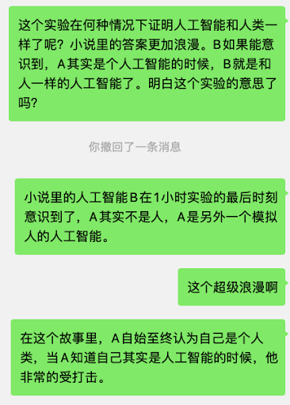

提前说明，有少量剧透～

好久没有读早坂的作品，虽然上木系列好像通过5部完结了，不过我也没有找到资源，我在看完了一部专业书籍之后想调剂一下，因此选了这部小说。
17年的作品，里面对AI的描写，很多是经不起推敲的，比如：ai如果能知道自己有框架问题，他自己怎么发现框架这个词接地呢。
哈哈，经不起推敲的细节明摆着，也让我看下去了，这不就是我喜欢的作品吗？
依然是我喜欢的风格，给出一个胡扯的案件，然后构建故事框架，让这个胡扯的案件变得合理，小心翼翼的透露信息，精心的构建故事，尽量让前后合理。同时又在细节上注入思考，在人物上尽量让其可爱。真是部不错的作品。
所以，每天看视频也没有啥吸收和输入，我要不要再好好看看书呢？如果能让我静下来的话，看书不好吗？
