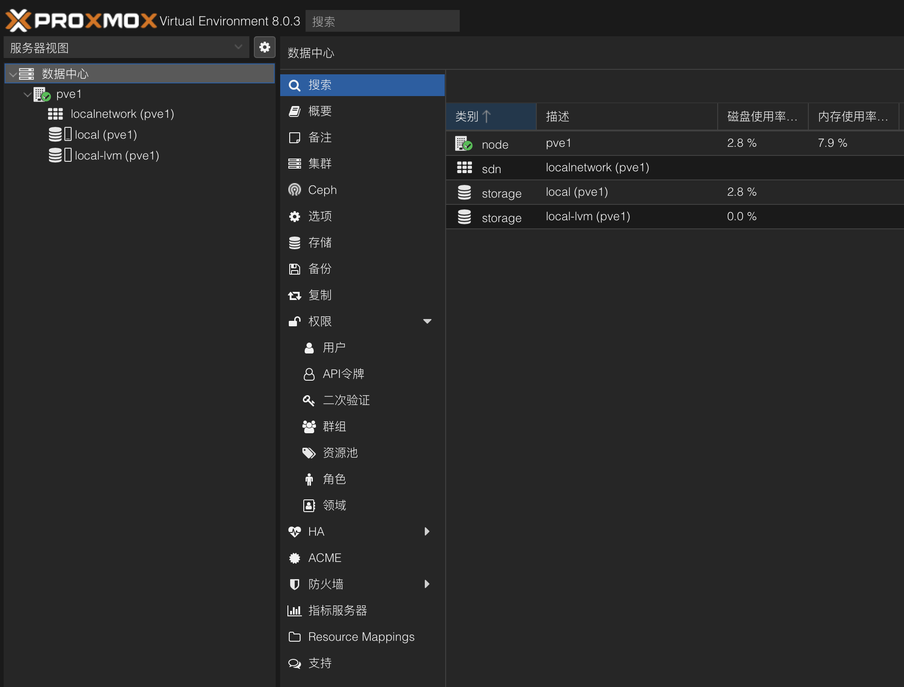
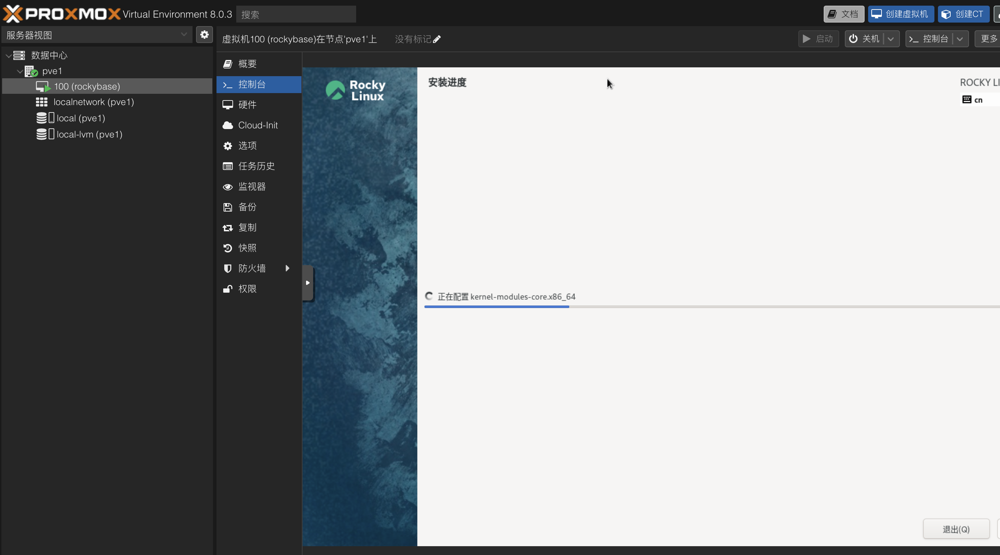
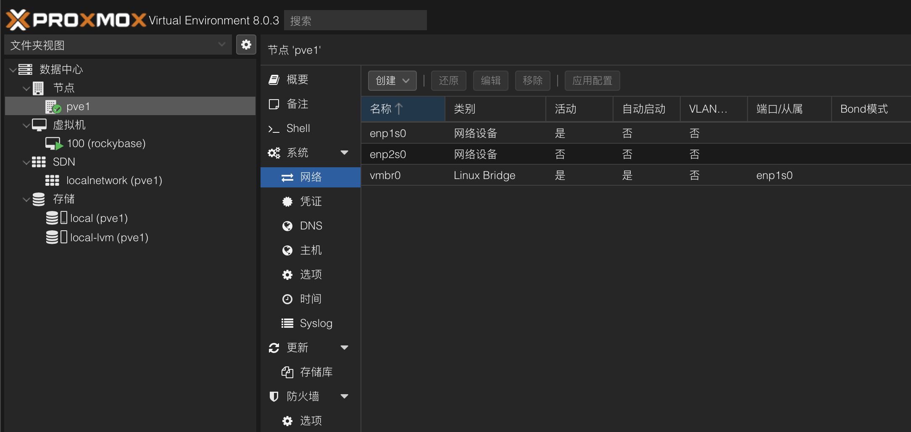

## 前言

假期屯了不少书，准备给自己一个充实的假期。好多东西想学习，airflow、superset、scrapy等，另外还想学习rocky linux，还有之前的kvm和pve的内容也想巩固。


另外，我终于有机会把这个学期学的内容进行实践了，目前的规划是给旧笔记本安装fedora，给小mini主机安装pve。新的小mini主机就作为服务器使用了。

fedora的安装还是很简单的，调整一下AHCI就能找到硬盘了。可是即使如此我也安装了两遍。问题出在密码上，新安装之后密码无法进入，第二次安装的时候注意到了原来是输入密码的时候输入法是大写状态。DELL电脑的win系统开机就会风扇狂转，现在安装了fedora之后，变得特别安静（下载软件的时候还是会有一点点声音）。

## 然后就是重新搭建基础

家里的旧电脑有点多了，显示器只有一台（多了桌子也放不了），要让我的mac重新能支持双屏幕估计要等到下次升级了。经过多次思考后决定让mini主机安装PVE：
第一点，如果我用fedora服务器，每次还要安装sshd和vnc，考虑到这麻烦情况，还不如直接用http控制电脑；
第二点，考虑到要做的本地项目组件众多已经有点复杂了，越早熟悉虚拟化平台能够越早启动项目。
第三点，如果可以把远程开发环境搞好，以后就有了坚实的homelab基础了。

## 安装PVE

长时间的调研准备，开始工作居然拖了这么久。这里要说一下，全新的mini主机自带win11 pro，什么都还没有安装开机风扇就想个不停，虽然我现在不能明确问题所在，不过，这个情况让我对win依然是不太有好感。

先不要考虑ip地址的设置，一把点安装。PVE安装时间意外漫长，检查了一下，居然卡在了“create LVs 3%”，没有想到一开始就这么不顺利。[也有提示说不用管它，这是正常现象](https://forum.proxmox.com/threads/proxmox-installation-stuck-on-3-creating-lvs-please-help-guys.94650/)，果然多等了一会儿，后面安装就非常快了。安装成功了，然后就是要考虑ip地址接入的问题了，找根网线把机器接入到网络中，修改interface文件和hosts文件，把ip地址设置到静态。

``` bash
vi /etc/network/interfaces
vi /etc/hosts
systemctl restart networking
reboot
```



安装操作系统的时候意外顺利。



一天下午的时间，我就安装了pve,fedora,rocky linux，感觉是挺充实的，并且由于之前阅读的关系，kvm的书籍让我重新理解了网络的模型，可以在配置上更加得心应手。



## 修正系统时间

既然要折腾，就肯定有小修小补，比如，发现时间错误了，要改一下时间。pve的时间是错误的，而虚拟机的时间是正确的（date -R）。[先尝试用hwclock解决了](https://www.tugouli.cn/3642.html)，一个有意思的现象，根据命令行修改时间之后，我的登录直接退出了！应该是系统根据这个时间判断登录时间的，非常透明和“干净”的感觉!查了一些文档，果然如果条件允许的话还是试试ntp服务吧。
