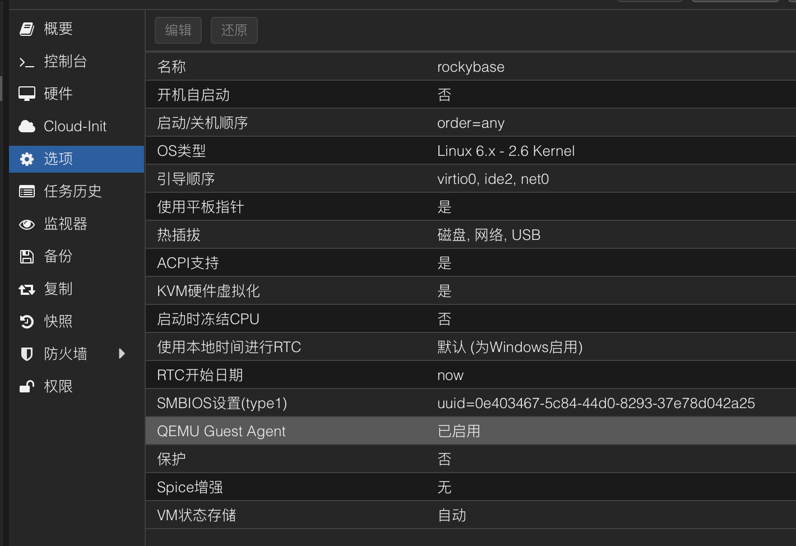
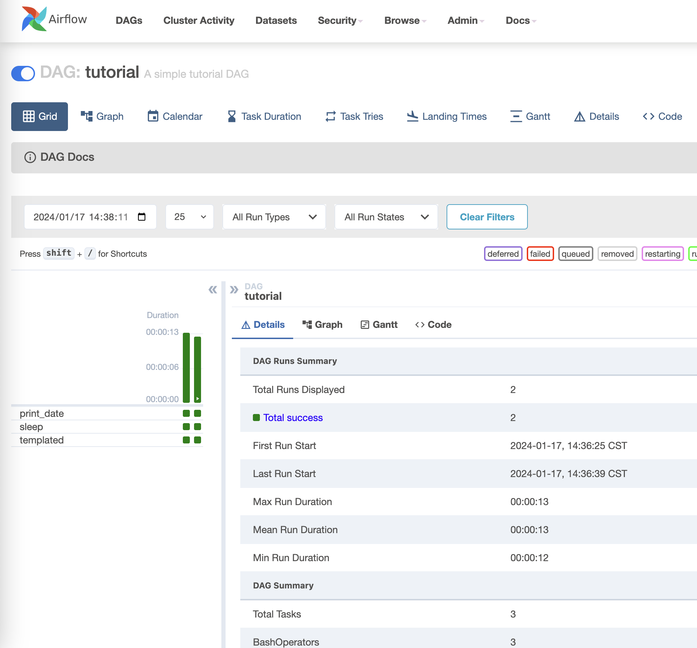
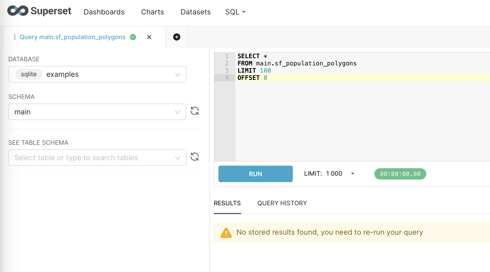
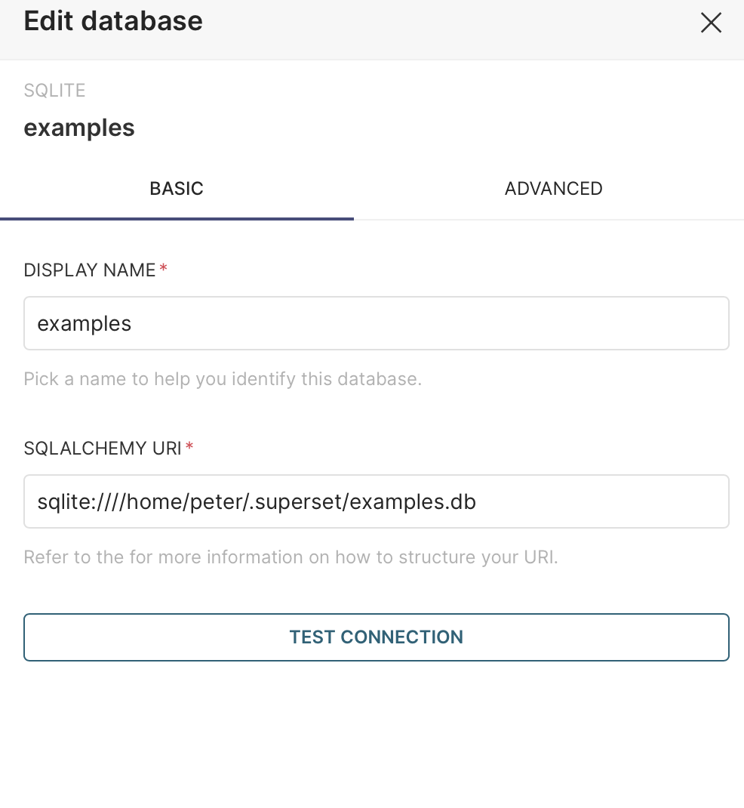

## 前言

假期屯了不少书，准备给自己一个充实的假期。好多东西想学习，airflow、superset、scrapy等，另外还想学习rocky linux，还有之前的kvm和pve的内容也想巩固。


另外，我终于有机会把这个学期学的内容进行实践了，目前的规划是给旧笔记本安装fedora，给小mini主机安装pve。新的小mini主机就作为服务器使用了。

fedora的安装还是很简单的，调整一下AHCI就能找到硬盘了。可是即使如此我也安装了两遍。问题出在密码上，新安装之后密码无法进入，第二次安装的时候注意到了原来是输入密码的时候输入法是大写状态。DELL电脑的win系统开机就会风扇狂转，现在安装了fedora之后，变得特别安静（下载软件的时候还是会有一点点声音）。

## 然后就是重新搭建基础

家里的旧电脑有点多了，显示器只有一台（多了桌子也放不了），要让我的mac重新能支持双屏幕估计要等到下次升级了。经过多次思考后决定让mini主机安装PVE：
第一点，如果我用fedora服务器，每次还要安装sshd和vnc，考虑到这麻烦情况，还不如直接用http控制电脑；
第二点，考虑到要做的本地项目组件众多已经有点复杂了，越早熟悉虚拟化平台能够越早启动项目。
第三点，如果可以把远程开发环境搞好，以后就有了坚实的homelab基础了。

## 安装PVE

长时间的调研准备，开始工作居然拖了这么久。这里要说一下，全新的mini主机自带win11 pro，什么都还没有安装开机风扇就想个不停，虽然我现在不能明确问题所在，不过，这个情况让我对win依然是不太有好感。

先不要考虑ip地址的设置，一把点安装。PVE安装时间意外漫长，检查了一下，居然卡在了“create LVs 3%”，没有想到一开始就这么不顺利。[也有提示说不用管它，这是正常现象](https://forum.proxmox.com/threads/proxmox-installation-stuck-on-3-creating-lvs-please-help-guys.94650/)，果然多等了一会儿，后面安装就非常快了。安装成功了，然后就是要考虑ip地址接入的问题了，找根网线把机器接入到网络中，修改interface文件和hosts文件，把ip地址设置到静态。

``` bash
vi /etc/network/interfaces
vi /etc/hosts
systemctl restart networking
reboot
```


安装操作系统的时候意外顺利。


一天下午的时间，我就安装了pve,fedora,rocky linux，感觉是挺充实的，并且由于之前阅读的关系，kvm的书籍让我重新理解了网络的模型，可以在配置上更加得心应手。


``` bash
sudo dnf install qemu-guest-agent
sudo systemctl start qemu-guest-agent
sudo systemctl enable qemu-guest-agent
sudo systemctl status qemu-guest-agent
```



创建好base镜像，系统配置乱了随时回来。

## 修正系统时间

既然要折腾，就肯定有小修小补，比如，发现时间错误了，要改一下时间。pve的时间是错误的，而虚拟机的时间是正确的（date -R）。[先尝试用hwclock解决了](https://www.tugouli.cn/3642.html)，一个有意思的现象，根据命令行修改时间之后，我的登录直接退出了！应该是系统根据这个时间判断登录时间的，非常透明和“干净”的感觉!查了一些文档，果然如果条件允许的话还是试试ntp服务吧。

## 安装fedora服务器

把dell xps改装成了小型服务器，合上盖子不休眠真的很容易配置。

``` bash
sudo vi /etc/systemd/logind.conf
    change #HandleLidSwitch=suspend
    to HandleLidSwitch=ignore
sudo systemctl restart systemd-logind.service
```

然后就是配置虚拟机和插件：

``` bash
dnf install cockpit-navigator cockpit-machines
dnf install qemu-kvm libvirt libvirt-daemon virt-install virt-manager libvirt-dbus
sudo dnf install podman
```

一个小型的服务器也准备好了，至此我的书架上有了linux、macos、win三个小型的环境，另外还有个pve主机可以一步一步继续学习了。

## 安装airflow

开始安装体验，官方的文档有很详细的安装教程，不过我还是想先从podman开始。

``` bash
dnf install podman
podman pull apache/airflow
podman run -d -p 8080:8080 airflow
#安装并启用端口
sudo firewall-cmd --list-all
sudo firewall-cmd --zone=public --list-ports
sudo firewall-cmd --zone=public --add-port=8080/tcp --permanent
sudo firewall-cmd --reload
sudo firewall-cmd --zone=public --list-ports
```

并没有成功，`podman ps`发现容器退出了，使用`podman logs -l`返回的内容居然是“airflow command error”，不得不说，非常诡异。最后尝试使用helloworld测试一下podman是否装好。

``` bash
podman run hello-world
podman logs -l
```

看到输出的一瞬间我明白了。airflow的错误输出正是由于logs命令运行正常，是我没有对airflow做正确的配置。

如果用容器运行airflow不是最默认的方式肯定是有原因的，尝试没有配置好的话，就按照[最默认的方式来吧](https://airflow.apache.org/docs/apache-airflow/stable/start.html)。

干净的系统居然没有pip，需要自己安装`python -m ensurepip --default-pip`。



基础硬件设施解决之后发现，其实很多开源软件直接安装即可，容器化并不能让每个问题都简单，甚至有时在不熟悉的情况下会复杂化。

## 安装superset

这次学老实了，先跟着[教程](https://superset.apache.org/docs/installation/installing-superset-from-scratch/)走。superset感觉是个“纯”的python包，如果考虑后续使用，也许可以借鉴一下jupyterhub的安装经验。

配置防火墙启动：`superset run -h 0.0.0.0 -p 8088 --with-threads --reload --debugger`

启动之后发现无法登录，依然是仔细看日志，然后在[社区找到处理方案](https://github.com/apache/superset/issues/24579),这里提一下，这个社区的处理方案，提问人提问的方式太棒了非常详细。最终采用了两个配置建议（包括“TALISMAN_ENABLED”），最终见到了欢迎页面。中间一度很多错误，让我转向了docker部署，不过最终还是解决了。（原因是忘记运行`superset init`命令了）



``` txt
[Unit]
Description=Superset Application

[Service]
User=peter
ExecStart=/usr/bin/bash /home/peter/superset/superset_run.sh

[Install]
WantedBy=multi-user.target
```

``` bash
source /home/peter/venv/bin/activate
export FLASK_APP=superset
export SUPERSET_CONFIG_PATH=/home/peter/superset/superset_config.py
superset run -h 0.0.0.0 -p 8088 --with-threads --reload --debugger
```

最后就注册成服务，可以随意使用了。其中有个点，如果User配置为root，账号密码不可用。这样让人非常在意账号密码存在哪里？还是说执行初始化的时候和用户关联了？


