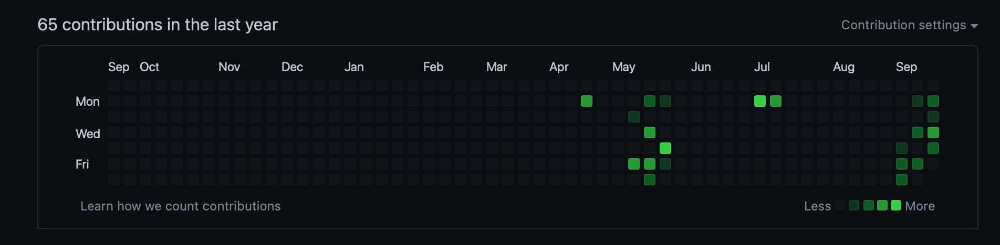

## 心境变化的起因

虽然很多时候，有“差生文具多”的嫌疑，我自己的google blog其实也没有太多问题（只是访问不了而已）。不过还是花了不到一个小时的时间把这个博客架设起来了～



起因非常突然，今天突然看到了我的github绿色马赛克多了（如上图），我意识到自己最近一段时间状态不错😌。想着把博客也转过来吧，把笔记本里沉睡的一些东西写出来。虽然有点担心自己写的东西不成熟，也许日后看来是胡言乱语，但是想着还是公开出来比较好。未来可以整理吗～～

## 我沉迷typescript了

最近，开始痴迷了typescript和对对应的前端开发，react,next.js,vscode，github，等等很多东西让我有点静下心来了。有点点收获，比如，发现在ts中，reduce真的可以完全代替循环存在，于是乎，写出了以下代码：

``` typescript
const FitInfo = (carList: CarItem[]) => {
    const combine = (years: string[]): string => {
        const year_combine = years.reduce((acc, year) => {
            if (acc === '') return year
            const left = acc.slice(0, acc.lastIndexOf(',') + 1 + 4)
            const right = acc
                .slice(acc.lastIndexOf(',') + 1, acc.length)
                .slice(-4)
            if (Number(year) - Number(right) === 1) return left + '-' + year
            if (Number(year) - Number(right) > 1) return acc + ',' + year
            return acc
        }, '')
        return year_combine
    }
    const description = sort(carList)
        .asc([(u) => u.make_name, (u) => u.model_name, (u) => u.year_name])
        .map((v) => {
            return {
                carname: v.make_name + ' ' + v.model_name,
                year: v.year_name,
            }
        })
        .reduce((acc, item) => {
            if (
                !acc.some((it): boolean => {
                    return it.carname === item.carname
                })
            ) {
                acc.push({ carname: item.carname, year: [item.year] })
            } else {
                const obj = acc.find((it) => it.carname === item.carname)
                obj?.year.push(item.year)
            }
            return acc
        }, [] as { carname: string; year: string[] }[])
        .reduce((acc, item) => {
            return acc === ''
                ? item.carname + ' ' + combine(item.year)
                : acc + ';' + item.carname + ' ' + combine(item.year)
        }, '')
    return description
}
```

我自己突然有些联想，长辈提过他上学的时候就是学习的lisp，不知道能否和他交流（大概率是不行吧🙍‍♂️）。lisp把数据和程序混在一起。我再看这段代码，循环完全是用reduce实现的，也许真的存在严禁证明for可以是不必要的。map、reduce就可以完成遍历操作。在我的程序中，为了实现目标，我引入了很多中间神奇的数据结构（指的是`{ carname: string; year: string[] }`），也许这就是数据和程序混在一起的感觉？利用数据结构来实现循环目标？不清楚了，希望我也能有朝一日接触到学院派的内容。当然，希望接触目标的时候能有足够的实践：比如，写个智能合约😊。

大概就是这么多，有点点困了，指针过了12点了，晚安。
