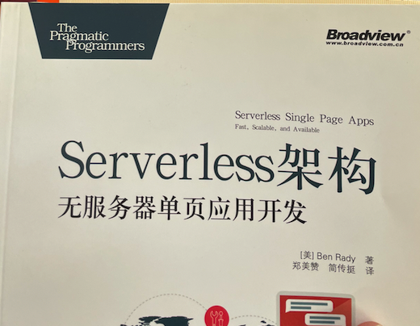
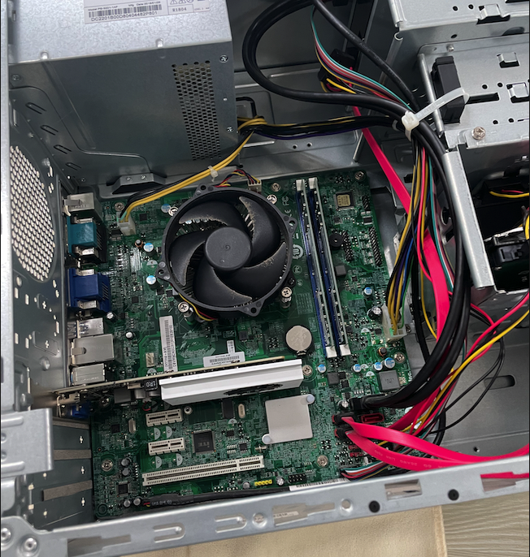

## 准备开始我的AI项目了

读了两本书，感觉找回了当初“开卷有益”的感觉。从图书馆借书其实非常的方便，这让我想起了大学的时候，那会儿就是每天每天不停的看书。很多学到的东西收益终身。

现在要开始新的征程了，东撞西碰的回顾这么多年，发现github是个非常好的网站，即使几度放弃，结果，最终发现，最可控也最方便记录的居然是这个小小的静态博客。不知道有没有精力能把google.blog上的文章搬过来，也许这个目录未来会很大，不过，也许我也写不了那么多内容吧，谁知道呢。借助cloudflare的cdn和pages换了一个独立域名,发现意外的顺畅……再次感叹如果有好的IT基础生态，喜欢“折腾geek”得是每天都生活在幸福中吧。

在经过多次尝试和思考后，最后想着，要不先选择cloudflare这个平台（腾讯云上已经开通的虚拟机还是准备维持着），尝试开始新的项目，担忧也不是没有，只是希望这次能是个有反馈的长赛道。

后续的文章还是编号吧，这样便于管理，看了书，下一步就是熟悉各类项目了，先从记事本开始也许是个不错的主意。
