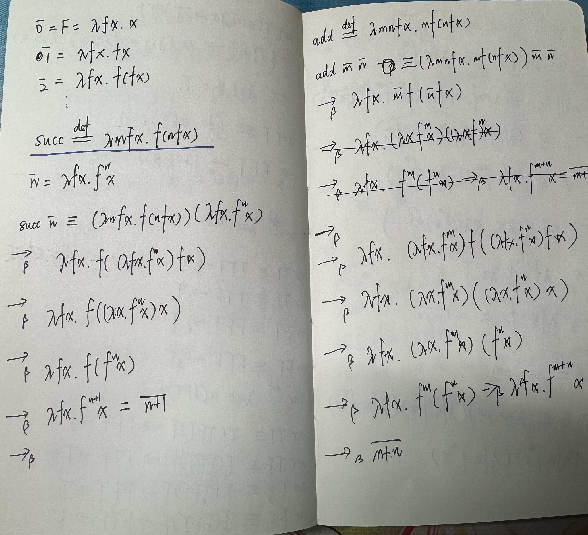
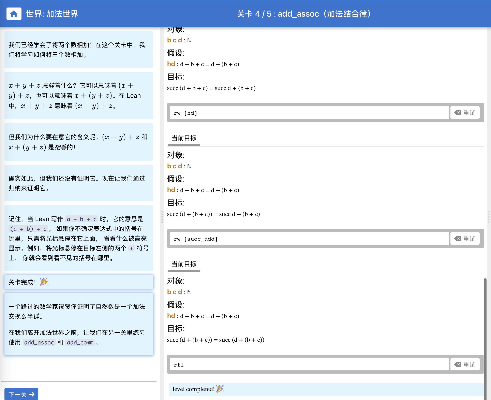

---

title: 《数理逻辑--证明及其限度》读书笔记
description: ''
pubDate: 2025-2-8T16:54:59
tags: ["BookNotes", "Mathematics"]
slug: mathematical-logic-reading-notes
author: 'fushenyang'
---

## 前言

我要读《数理逻辑--证明及其限度》。写下这篇文章的时候我还在看龙骨，想不到我自己可以同时开两本书的阅读。契机就是看到了lean语言，读到了一些科普读物。尝试要在图书馆借一本书，不过，最终借到的教材不太好，最终选择了买二手书。

我希望这本书也能读完，因为我考虑形式证明如果能用lean这样的语言实现，那么是不是可以再区块链这类协议中应用呢？AI应用即然不准确，是不是把逻辑模块添加进去能加强整体性能呢？现在各种AI编辑软件其实都不好用，解决不了问题，我是否能做出来一个特定领域解决极致的问题呢？等等、等等想法，希望我在读完这本书后能获得一部分解答，或者获得更多的问题。

## 函数式编程的学习，让我重新理解了逻辑

是的，我好几次想看数理逻辑失败了，并且，我发现我可能并不是真的想看数理逻辑，我只是想看一下日常生活或者工作中有没有什么数学的本质，希望这个本质能治愈被日常小内耗消耗中的我的无聊神经。设定系推理很棒，但是我还是希望更好的东西能出出现，非常棒的，我接触到了lambda演算，这一步让我可以从最基础的计算符号$\lambda$获得到很多东西。

中间也有小遗憾，我因为比较懒，没有详细记录这个过程的学习路径，即参考了哪些资料、有怎样的思考路径等等。如果能记录下来就好了，因为后面明明显发挥了难以想象的效果。

在学习范畴论的过程中，我发现“自然数加法”是非常好的例子，甚至都不需要负数，一个特别好的交换群。集合、原群、半群、幺半群、群、阿贝尔群……这些概念慢慢进入我的视野，在某些时刻（比如，使用范畴解释x^0=1）给我带来了非常有趣的洞见快乐。

我有时也会进行凡尔赛思考：加法是不是给的太多了？我的意思是，本来大部分时间我要通过加法做思想实验来研究Category、Monad等概念，这些更多只是Monoid，不需要用到交换的性质。这时，前期学习的效果出现了：我能够非常开心的接受加法是因为我想起了我在2025年4月份的时候找到了非常好的学习资料，并且自己完成✅了加法的推导，我自己搓了加法。这样让我能够构成一条相对完整的知识线，可以说非常开心了😄。

## 下一步的工作

下一步我发现我有非常多可以做的事情，比如，我尝试在通过动手学习来加深理解，实际上已经在通过完成[《写给程序员的范畴论》第一部分的课后习题](/Category-Theory-for-Programers-Homework-Answers-cn/)来强化理解，也许结合使用haskell我能深入理解更多的编程方式，就像我当初学习面向对象强化了我C#的书写方式。

还有个非常有意思的思路，我在做习题的时候发现很多证明我不能确定是对的还是错的……即使有时候有书籍，我能够确定自己对了吗？或者我拿到的定理证明正确吗？以上疑问在我尝试理解Monad的时候特别明显。

这是我发现，程序的运行正确是可以形式确定的，计算机可以帮助我。那么，我是不是有了一个学习Lean的动机，如果我能用Lean证明这些定理，这样是不是有了一个让我可以踏实进步的工具。

## 一些参考资料

- [Lean4定理证明](https://subfish-zhou.github.io/theorem_proving_in_lean4_zh_CN/title_page.html)让我心心念非常感兴趣的编程语言。
- [lambda演算wiki](https://oldyang.site/mathematical-logic-reading-notes/)至少有官方的渠道
- [自然数游戏](https://game.lookeng.cn/#/g/local/NNG4)Lean4的非常好的学习工具
