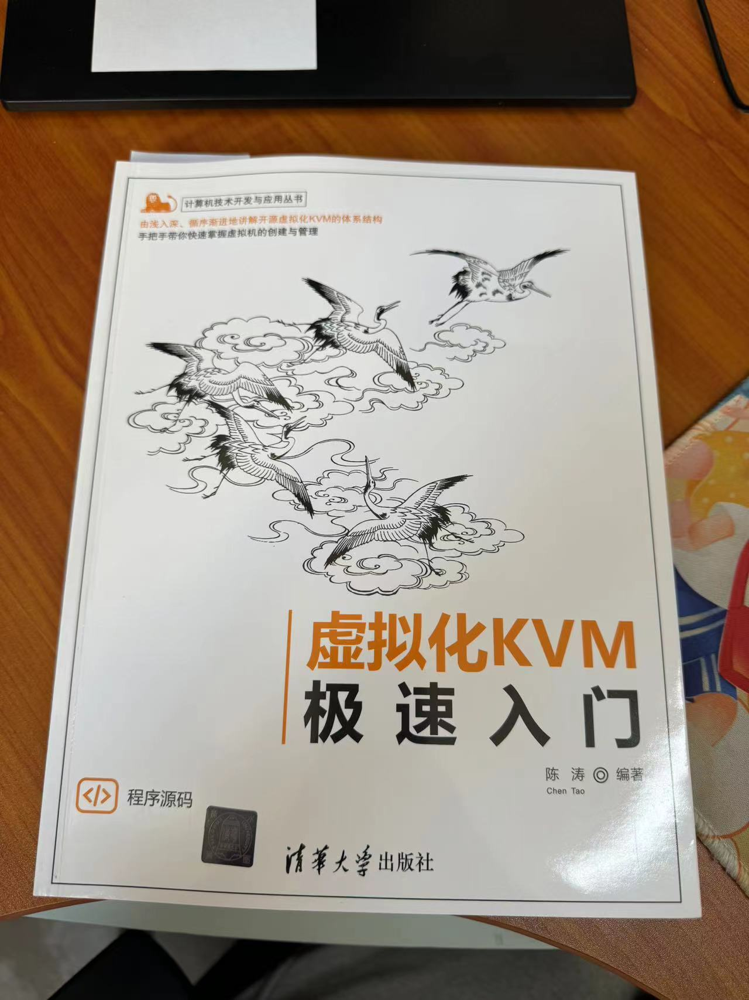
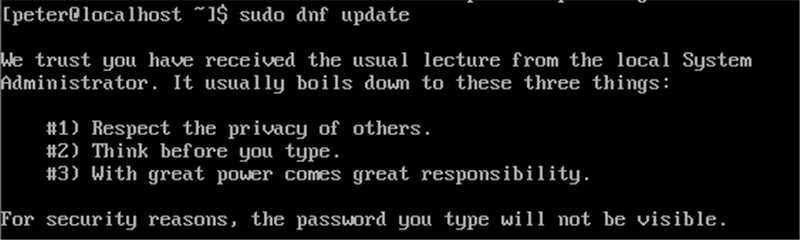
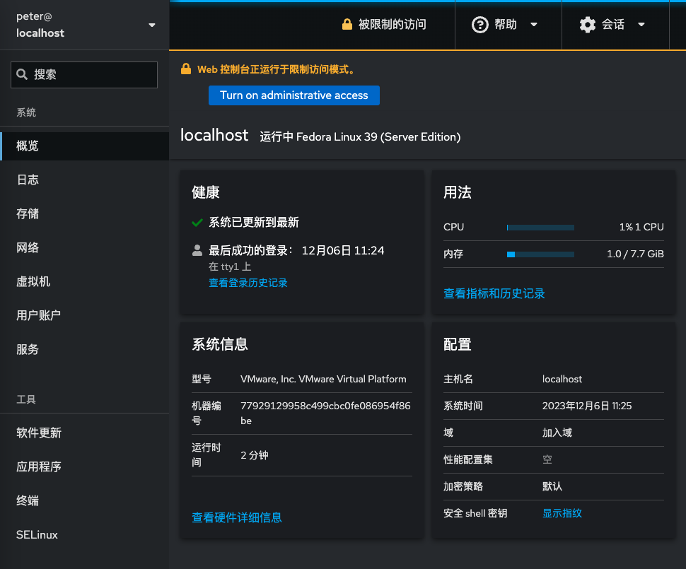
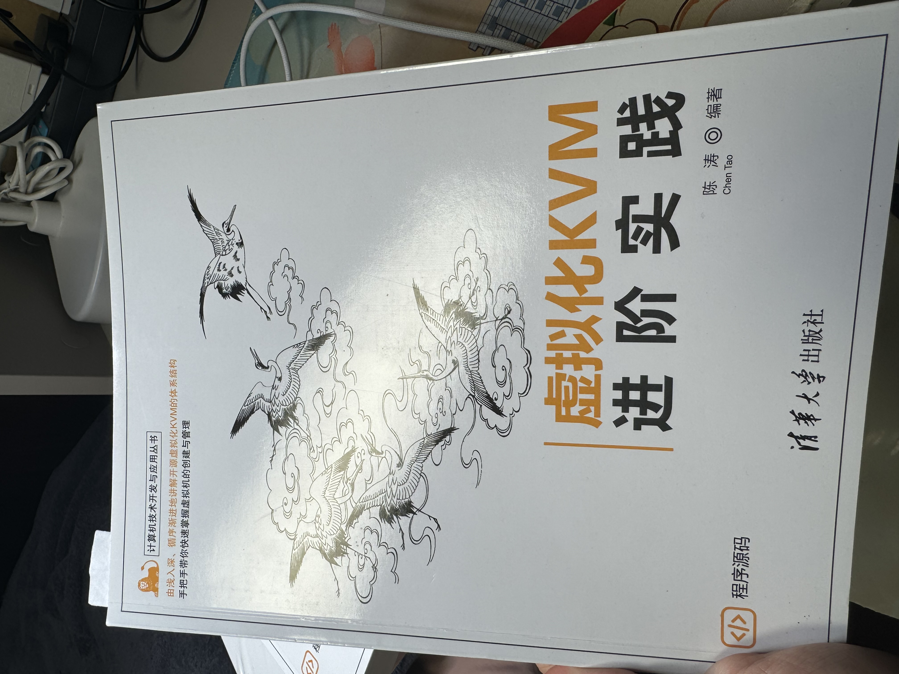

## 封面



## 前言

虽然琐碎的工作很多，但是，还是要加强学习保持充电为未来做准备。依然是非常朴实的书，就是讲解日常操作，顺利读完可以补充非常多的基础知识。想到很多时候，不管是运维还是开发，更多的是有条理的组织起基础工作，从这个角度考虑读这本书挺好的。

## 笔记

QUME这个东西，10年前就听到同学介绍过，当时如果好好学，直接就在linux体系里学习是不是会有很好的收获呢？也不一定。libvirt，virtIO、virt-manager等这些关键词也真实的的了解到了，并且特别好的一点，书里用cockpit做例子，非常实用。

读书真的是学习的捷径，只要能静下心来好好读好书，其实就可以节省非常多自己试错的成本。今天有个好消息，用于支持虚拟机学习的内存到货了，希望内存安装可以顺利。

## 实验环境开始

开始了新的学习，首先是文具的就位。


[借助教程](https://blog.csdn.net/qq_46499134/article/details/124231658)和[网友建议](https://blog.csdn.net/CNjcdyl/article/details/124802614)，准备开启windows的虚拟化选项，给自己建立一个简单的实验环境。


实际处理的时候：关闭所有的hyper-V服务项目、取消所有的虚拟机功能、关闭windows本身的内核保护，这样就可以嵌套虚拟机开始学习了。



## 操作记录

默认安装的服务器版本，没有gui，即使是软件包中也没有包含gui的选项，思考了一下，也许可以尝试不用GUI，就用fedora39锻炼一下也未尝不可。第一个问题，先执行一下dnf update。发现速度很慢……果然第一项还是设置更新源吗？实际运行发现安装软件包非常快速！然后解决联网的问题，我突然灵光一动，保证外部可以访问，也保证可以联网，只要配置两块网卡就可以了，这样还能熟悉一下网络配置。




一步一步完善cockpit的使用，首先是安装文件管理器，这样上传下载文件能方便许多，[文件管理器](https://github.com/45Drives/cockpit-navigator)。

```sudo dnf install cockpit-navigator```
这样就能进行文件管理了，利用文件管理可以上传ISO镜像，这样就可以安装操作系统了。

一开始就碰到了权限问题，NFS默认是无法写入，只读的。查了一些资料，no_root_squash等适当的配置选项可以解决问题，不过这样感觉不安全，后来看来的[教程](https://blog.csdn.net/iamwayne10/article/details/107509098)提到可以将文件夹other属性打开，这个思路更加合适。虽然可以用终端解决，但是想了一下，还是尽量学习一下OMV吧。


把权限设置正确之后就可以使用NFS了。

## 快速开始第二本书

东凑点时间，西凑点时间，虽然断断续续，但是最终还是把第一本入门看完了，开始了第二本的阅读。



这次阅读之所以这么快也是因为实操实验进行的少。收获也是非常大的，入门教程里把虚拟机的虚拟网络解释的非常详细。

这本书更多的是利用间隙去看，其中很多内容，corosync、pacemaker等这些高阶项目确实让人受益匪浅，了解了非常多之前不知道的知识，比如stonith设备。比如集群的高可用本质就是让虚拟机在物理机器上飘移，再比如，virsh居然有如此的配置参数，而配置方式就是简单的XML文件，再比如，NUMA的vcpu和cpu的位置居然是可以指定的，等等。
实体书可以留下来，这样后续如果有用到相关的内容可以快速参考。

## 小结

kvm这本书真的是开卷有益的典型，如果早点知道这些内容，也许我就会更早采用kvm技术栈。可惜，一开始准备的内存其实并没有发挥什么作用。

## 操作笔记

尝试安装了ubuntu，然后意识到了ubuntu默认的磁盘管理已经到了lvm了，刚好学习一下。[这里是操作参考](https://cloud.tencent.com/developer/article/1965711)
