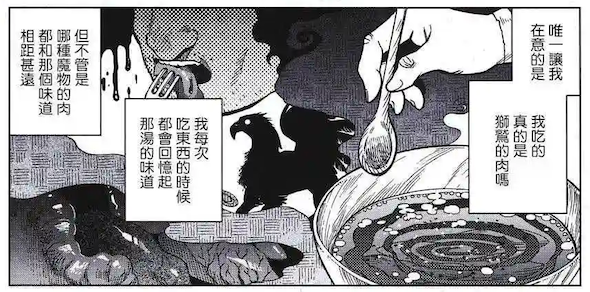
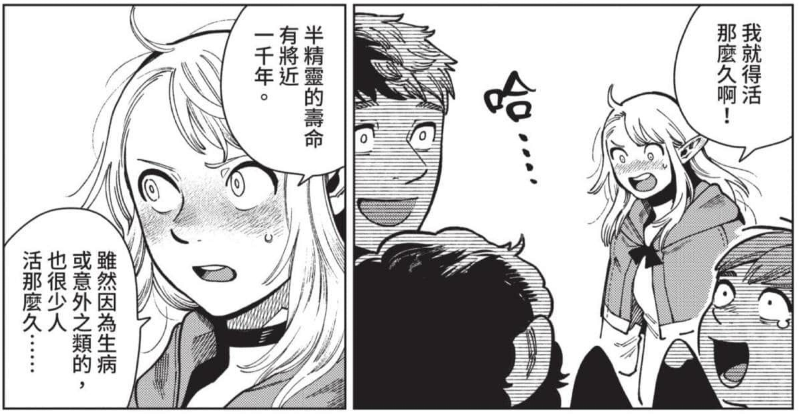
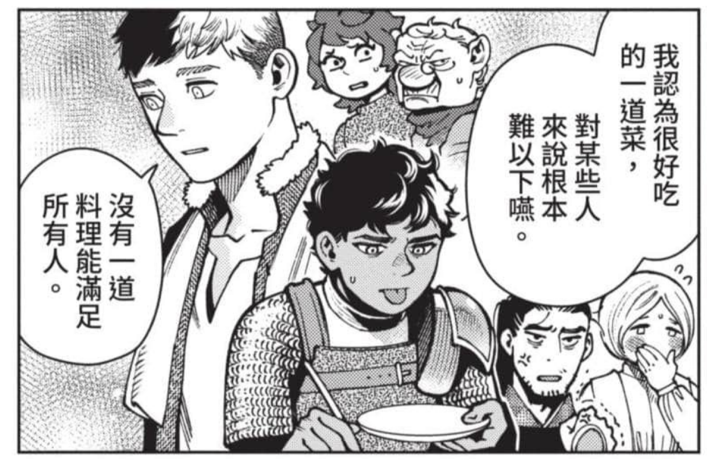

## 前言

**《迷宫饭》**，好久没有时间看一部漫画了。好多漫画都是虎头蛇尾，能有时间看看漫画感觉还挺幸运的。

关于矮人过去的故事演绎成了一个小的推理故事，读者和大部分人物根据叙述接受了第一重最容易理解的解答，而看似神经大条的男主，居然扮演起了不断思考的角色。（当然最终解答是变形菇……也是太水了）

## 漫画下载

平时总是很懒，都是临时想到下载，这次找到个新的途径，其实用alist可以挂载baidu和aliyun，然后把百度的东西转到阿里云里，这样就能中间过渡一下，基本上一个晚上的时间，就能完成转移，这样就不用和百度浪费时间了。感觉花费在homlab建设上的时间非常值得，好像种地一样。

## 很多彩蛋

“巨怪”来自于半身人的语言，指的是人类！好棒的解读。

## 关于欲望

看到第11卷的时候，迷宫中关于欲望的讨论似乎非常的深刻。“迷宫满足人的愿望并以欲望为食”，感觉在映射梦魔的小章节。

## 关于寿命

关于寿命的思考，再次出现了，长寿是诅咒的命题似乎贯穿始终。这个地方似乎和芙利莲接上了。

## 关于食物

“差异性”的重要，这个类似于我之前的表述“所有人不可能在一张桌子上吃饭”，感谢作者有了更好的表述。

## 关于主题

登场的所有怪物都是魔物，只有迷宫核心是恶魔，非常开心这部作品把恶魔放到了非常棒的位置。恶魔的不死不灭、无限力量、以欲望为食，正好又补充了我对恶魔学的感性认知。恶魔是概念而不是具体的东西，作者的故事内核很棒。

## 总结

非常好看的漫画，中间很有趣。最后的主题：“吃是生者的特权”，主题凸显的也非常好。
