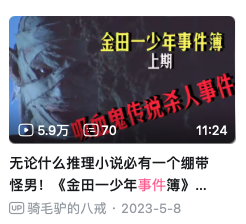
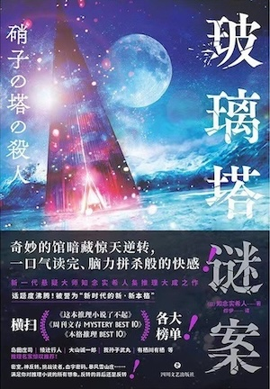
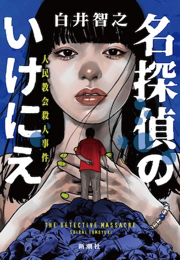
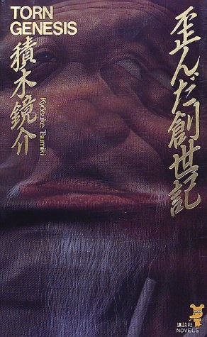
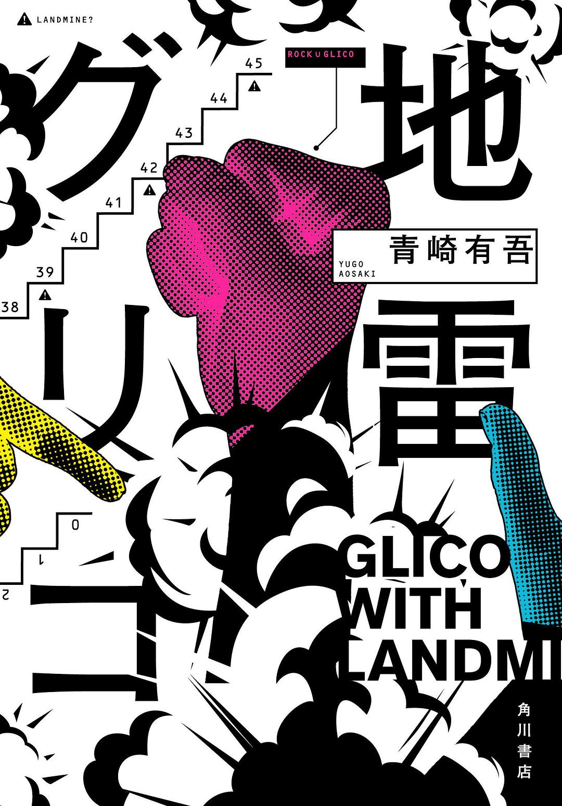
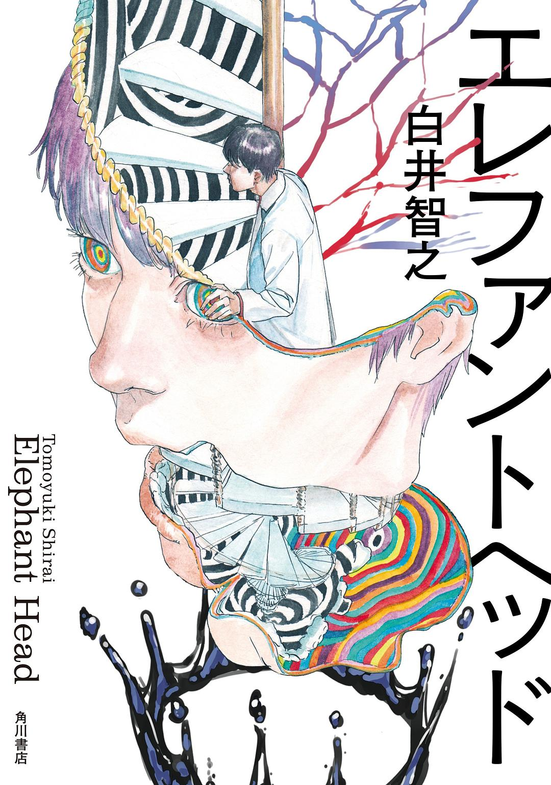

## 前言

这个题目好犹豫，其实并不是想写这种主题不清晰的文章，不过，也确实很久没有更新了，把最近看的书列一下吧，记录下读书时的感受，这次希望尽量全，每本简单带过。

## 日常小插曲

有一天，和妻子看视频，刚好有B站up解说金田一事件簿真人版，然后我就兴奋推荐和妻子看了一集。《吸血鬼传说杀人事件》，平心而论，因为视频做成了上下两集，看上集的时候我妻子还挺好奇的（不能说被吸引吧，至少想知道结果），然后看到下集，我媳妇脱口而出“这是什么玩意儿！！”，我当时就笑出来了，对对对，就是这种感觉，看新本格是要有这种感觉的。如果，能长久的记录下这份冲动就好了。

意外的发现了一个非常棒的推理电台[“推心置理”](https://space.bilibili.com/10965623),聊的都是推理话题，有的书看过，有的书没有看过。比起读书来，很多这种讨论很有意思。就是这里，我听到了奇妙的评语可以用来文雅的形容那种读书感受：“有新本格的奇想感”。电台给了我去看小说的冲动，带着这份冲动，我看完了一个月之前开始读的《名侦探的牺牲》……

## 标题的误导--这个不是白井老师的问题，是我的问题

我要狠狠发泄一下情绪：我想起小时候的课文《一面》，不知道老师处于什么动机，把这个题目解释称“悬念”，他原话是：“只是看到这个题目，就引起了读者的悬念，谁和谁在什么情况下见了一面啊，引导读者读下去”。我当时就嗤之以鼻，什么鬼，怎么就见面了，只看题目我以为是做饭的！对啊！！题目什么都没有说啊！！

这是一个例子，让我时常有想法，如果能回到过去，在课堂上，让老师好好讲解一片推理短篇作品（最好是叙诡）该是多么美好的回忆呢……转入正题，《名侦探的牺牲》就如同我上面讲的故事，不过，有细微的偏差，我只从题目完全误解了题目的意思，“牺牲”被我理解成了动词，其实从故事看应该是名词，这个是我到最后几页才发现的。所以，有些翻译成了《名侦探的献祭》，这个翻译更好一些，不过，如果按照献祭来看，我可能依然会误解。

读完后再来看题目，emm，是不是“why do it”的答案就出来了呢？（等等，我是不是剧透了，唉嘿嘿～）

干干净净的推理故事，2023本格推理Best10第一名实至名归。我的知道这本书的契机很有意思，有人评论《玻璃塔谜案》时候提到的，把《玻璃塔谜案》和这本书相提并论，因为玻璃塔谜案有些许争议（我依然很喜欢），所以衬托着这本书就把名侦探的牺牲读完了。啊，今年有《玻璃塔谜案》和《名侦探的牺牲》感觉就是不错的收获呀。

回到《名侦探的牺牲》的感想，三重解答都非常棒，虽然第一个解答应该算是“八嘎推理”，很多人觉得扯，但是我喜欢八嘎推理。这个不能计较的，要看整体和这个解答服务的故事，如果硬要较真，最后一个解答的第一案是个“内出血”啊！！[我看到有些评论写的非常好](https://book.douban.com/review/15351391/),这里评论网友认为，作品穿越了次元壁，理由是如果选择第二重解答，就是历史系推理，选择第三重解答就是设定系推理。

我其实不认可以上评论：读者是外人中的外人，天然客观，因此不可能选择第二重解答，就算真的选择了第二重解答，相信奇迹存在也不能认为故事就历史系了呀！毕竟……整个故事是新本格，就是牺牲了故事发生的可能性才带来了无比畅快的推理和无比浪漫的内心动机。其实两重解答有点像两种视角，如果是推理小说爱好者，那么，就如同我一样，非常非常喜欢整个故事，因为多种解答、双重密室、惊天动机……这些都是经典元素，现实中没有的，只有小说中有，且我有足够的阅读量产生预期，那我就是信徒视角。而对我妻子来说，可能这部作品只能产生“这什么玩意儿”的感慨，一如我读梅奖作品的感受，这估计就是外人视角了。

《歪曲创世纪》，名侦探的牺牲的回味无穷，我的“读遍梅奖计划”又启动了，然后就是看了，一句话“很有新本格的奇想感”。梅奖计划还是在放置一下吧，推心置理电台听完，我感觉还有更多好的作品可以看。

《RPG School》就比较有意思了，早坂吝老师的早期作品吧，果然没有让我失望。“东京都江户川区松江和岛根县松江市，哪哪都不一样。” 原来这就是让书中人物惊叹的叙述诡计。侦探是巴嘎情侣的设定也非常反差有意思，并且一定程度上，他们提供的也是巴嘎解答。很棒的一本书，特别是关于凶手的解答部分……等等，名侦探牺牲凶手好像也是……，是不是有点重复？

《地雷格力高》，暑假和妻子一起看了《不死少女杀人闹剧》，意外的不错呀。青崎有吾虽然久仰大名，但是，他的体育馆确没看过，这次看了23年的地雷格力高，真的是很有意思。轻松愉快，没有大梗。希望这位日本推理圈太子能够继续加油，也希望有一天，我能够有静静地时间和心情去看看他的早期最经典的作品。

《大象头》，看完了！！特别棒！！！没得说！！！白井老师回到了海里，但是又感觉没有完全回去。

## 推理小说和剧--碎碎念与迷茫

有些剧没有看完，《恶魔游戏》、《小市民》（动画）有些看完了《欺诈游戏：重生》、《女鬼桥2：怨鬼楼》，，《不死少女杀人闹剧》（动画），感觉看的东西很多，可是很多感受没有记录下来很可惜。不过多亏了推心置理电台节目的介绍，让我对读小说又重拾了兴趣，有些书还是看完了，体会到了那种“新本格的奇想感，哈哈哈。”看书和看故事都挺难的，花时间精力，不过我准备未来看的书都记上一笔，让这种感受留下。

PS：尸人庄不错！
