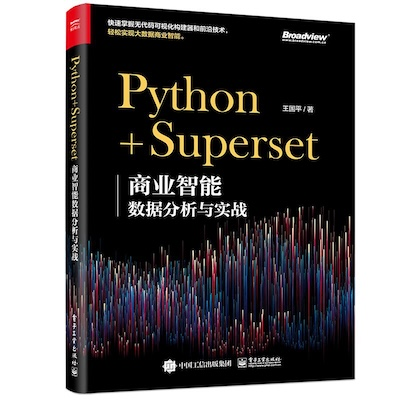
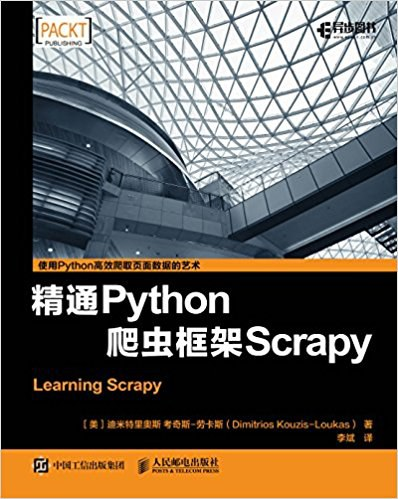
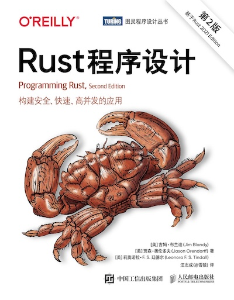

## 最近看了三本书

说是“最近”看了三本书，其实最早的一本也许就是两年前买的，最近看完了而已。其中《Rust程序设计》确实是内容有点点多，应了那句话“rust一点也不难，我学了好多次了”。

记录三本书的想法有一个月了，这一个多月我抽时间看完了《Rust程序设计》的最后几章，这样有个完整的有始有终。最近的读书过程有很多心得体会，但是没有时间去记录，稍事休息，一切细节和感受就遗忘了……有点可惜，但是又没有办法。至少这三本书于我个人而言对比特别明显，希望记录下来。

## 《Python+Superset-商业智能数据分析与实战》

京极夏彦笔下的小说里有句名言“所有的书都有趣”，这句话，我个人喜欢从“上下文”来理解，所有的书和事物都是在某个上下文存在的，也就是在某个“框架”中，孤立的事物或者概念不能存在也没有必要存在，一本书总会在某个特定的上下文中有趣，一句话，总会在某个特定的上下文中有其含义。

为什么会有这个想法呢？也许因为最近（是的🙂‍↕️，我的最近是一年的概念……）学习haskell的感触（果然还是要多学东西呢），在某处文字片段中，haskell的IO()容器被解释为和装饰器一样的概念，而装饰器本身是我最早学到的设计模式之一，并且也是用的比较多的。而haskell中的单子也可以被解释成提供计算上下文的容器，在同时去思考这些概念的时候我有点恍惚的感觉：最为重要的莫非不是针对“上下文”的编程或者说概念的明确？想到这里有很多例子让我豁然开朗了，比如，我过去纠结于魔术中的效果强度的概念“消失飞机比消失硬币效果更强”，当时我就思考，如果在飞行的飞机上，有个儿童失误吞下了硬币，那么此时，消失硬币的效果岂不是更强的效果？类似的我的内耗思考还有很多，这些内耗，我感觉都是“上下文”思考的结果。只有明确上下文的情况意义才能存在，相对的，只要上下文可以随意变更，所有的意义都可以随时解释，当然上下文成本更高吧。

铺垫了这么多，想说的就是，这个书之所以要记录在这里，或者说他的只得记录的地方也就是目前这个上下文了：这个书不好，但是她的不好衬托出了好书。因为日常工作和学习中确实存在一些可视化的需求，找到了开源项目superset，然后去京东搜索看到了这本书。内容非常广泛，但是特别浅显，作者介绍了各种数据库，但是这本来应该是在一个章节中完成的内容却被分散在了多个章节，另外，作者显然是有丰富的经验，但是没有很好的表达，他把对一个商业项目的可视化分析的例子，分拆在了每个章节的末尾，这样本来就不系统的例子更加分散，而且，这些例子即没有体现数据库特点，也没有很好的介绍superset的功能。也许作者更加合理的安排章节并给出一些更加洞见型的内容会更好。

## 《精通Python爬虫框架Scrapy》

惊艳！非常惊艳的一本书。其实从前言就吸引到我了，他精确描述了我的状况：开始是使用原生请求以及bs4之类的库，但是在某次之后选用了scrapy。在我买了这本书后我又进行了几次爬虫数据抓取的工作，直到最近的一次……在最近的一次之前，我的爬取速度慢，不稳定，甚至要通宵担心爬取会暂停，我甚至要自己写随机数来在出错的时候暂停几秒，而且还是阻塞整个程序的暂停……。而最近一次使用scrapy之后完成的工作非常漂亮，速度快稳定代码简洁，并且可以重复使用。

这中间可以记录的事情有很多，最大的感触是我应该踏实读书，买了书并不代表这本书属于你了。如果我第一时间拿到书之后就踏实学习，我中间少走的弯路难以想象（类似的事情在下本书rust学习中也出现了，我自己尝试了1个小时去解决的问题，其实在书中是有明显提示的，只是在书中比较靠后的位置）。

最后回到惊艳的感觉，书中提出的很多洞见让人耳目一新，比如“瓶颈应该出现在正确的位置”。以及如同推理小说般的阅读体验，在最后一章“优化”主题的内容中，我其实本来没有太大预期，因为我应该不会去“优化”某个系统或者脚本，我应该只会进行一些简单的工作，爬虫仅仅是工具……但是，作者却用了系统的统计学工具来查找发现问题！给出假设，根据结果判断是否接受假设……这种快乐的感觉仿佛是读了一本非常精美的“逻辑流”推理小说。

## 《Rust程序设计》

大厚本，我翻看聊天记录，至少我的朋友在2021年，也就是4年前告诉过我，solana是rust开发的，那时我就“看”到这门语言了。即使是买到这本书再到看完也是从2024年看到了2025年，甚至2025年的第一个月都勉强看完。

不考虑高中时期学习的basic（感谢我的好朋友），我最早接触的语言就是C/C++,但是我问自己一个问题的话：我真的用C做过什么产品吗？如果没有的话是什么原因呢？C的细节太多了，我能想到最接近的一次就是使用C语言构建二叉树希望解决我在数据建模竞赛中碰到的问题，结果是在节点数量达到200左右的时候程序会意外报错退出……源代码现在找不到了，我已经无从知晓当时的我是在哪里犯了错误造成了未定义行为。但是，实际上后来我尝试过各种编程语言，最终C#让我做了最多的作品，虽然大部分代码并没有留下来。

Rust的契机非常有意思，我对他的宣传中的“安全性”特别感兴趣，因而去了解并使用了Tauri。并且非常幸运的是，我在同时学习haskell，了解到函数式编程，然后发现了比起图灵机模型之外，还存在一个更加优雅的实现逻辑描述逻辑的方式。通过了解我发现rust真的是非常有趣，或者说，一直学习新的内容让人感觉非常有趣。

## 总结

2024年结束了，2025年是又一个开始。希望新的一年也能读很多书，收获新的进步。
