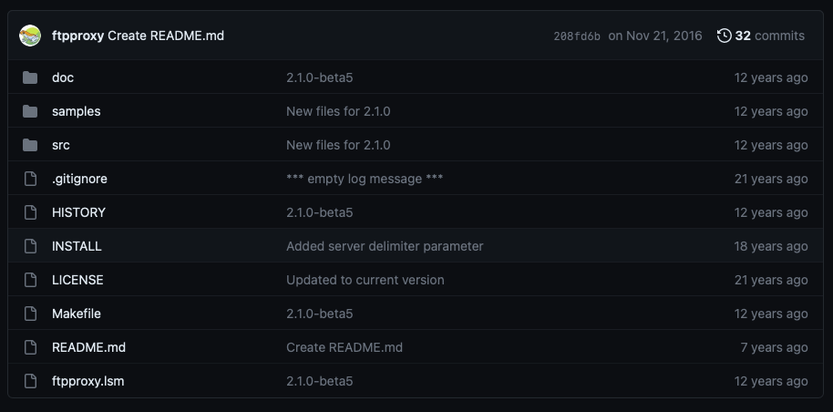
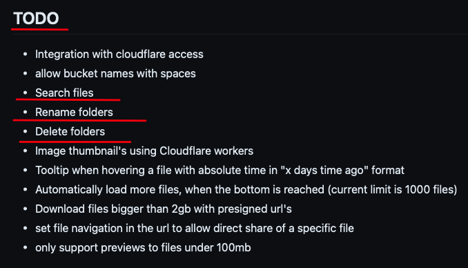

## 背景情况

跨区域的团队协作存在的很多问题，想象一下，团队成员在伦敦、硅谷、西安、北京，团队中领域专家、有数据科学家等，提供IT工具协调大家共同开展一个项目存在很多挑战。我目前碰到的一个问题是，如何在这些团队成员间共享文件，核心需求是"快"，并且足够“简单”。作为简单来说，第一个能想到的就是FTP服务了，虽然古老，但是这个协议确实足够简单，然后就开始了我的折腾之旅。

### FTP代理方案

先考虑一个简单的情形，英国有个团队，北京有个团队，FTP服务器设置在北京团队的工作地点。这个情况下，北京的团队访问ftp速度是非常快的(8-10M/s),此时英国团队的访问速度就很慢了。当前阶段，现有团队喜欢了FileZilla做客户端下载文件。如何使得现有的使用习惯维持尽可能的不变提高速度呢？我想到了第一个方案就是FTP代理方案了。

FTP的代理不太多。第一个默认想到的就是反向代理方案，“对他使用Nginx吧”。但其代理缺点非常明显，就是配置特别复杂，因为FTP的passive模式，需要开放大量端口，这样公开报漏的服务器也不会安全[^1]。另外一个是使用专用的FTP代理软件，各种找只找到一个ftp.proxy[^2]。看了一下，12年没有更新了。当然，我还是花时间试了一下，结果失败了（纪念我的一个小时时间），并不是个很好使用的方案。

当然最重要的一点是，这样真的能提速吗？原来的模式是，英国团队直接访问北京的服务器，如果添加一个代理，比如代理放到香港，那么带宽如何处理？英国到香港再转到北京真的能速度快吗？这个时候我又思考了一下初衷，可能团队需要的就是一个“快”而“简”的文件共享服务。如果精力放到代理上是不是错过了关注点？

### 一个新的独立的中间服务器

建立一个中间FTP服务，地理位置上位于英国和中国中间，这样让两边都可以有适当的访问距离。这个时候我想到了点子是：掉换主服务器和备份服务器的位置。本来我的计划里，要用腾讯对象存储（COS）来备份所有的文件的，要不把方向调转过来，使用COS作为主服务器，然后利用本地每日进行备份，这样所有的团队都可以访问中间服务器，也许速度能平衡一下？说干就干～

比较可惜，COS默认是不支持FTP服务的，官方提供了COSFTPserver工具[^3]。这里要吐槽一下腾讯云提供的这个工具，虽然不是不能用，实际配置过程中也确实有必要的提示，不过，使用腾讯自己的虚拟机依然配置困难（我碰到的问题是python依赖安装出问题，最终通过virtualenv模块顺利解决）。实际配置好之后，使用起来并不稳定，首先是挑选客户端，我常用的FE file explorer pro直接挂掉，以至于我一只以为没有配置好，最后发现FileZilla、cyberduck到是可以正常使用。缺点也是特别明显，就是速度慢，一些基本操作支持的并不好，比如，list速度比正常FTP慢很多，再比如，文件夹移动并不支持（勉强可以移动文件）。实现原理所限，估计也无法配置用户权限了。最后，也是最大的问题，速度的瓶颈在虚拟机器的带宽上。我之前没有想明白，就算用对象存储，实际流量也是先经过了架设FTP服务的虚拟机。比如，我使用轻量应用服务器的情况下，服务器只有1M带宽，然后此时的下载速度就只有可怜的200k/s。如果使用按量付费的服务器，带宽可以设置很高，此时北京的上传下载速度可以有1-2M/s，不过流量太贵了，1rmb/G，并且，如果按月选择高带宽的机器，价格更是贵的离谱，另外，可能还需要支付COS的费用。

最终这个方案暂时放弃了，价格贵，且很难保证稳定。我继续又想了，两个方案如果都不太行，是不是可以暂时放弃FTP的方案，关注于“高速文件共享”。

### 尝试围绕cloudFlare看看有没有合适的解决方案

重新会到起点，我现在实际需要的是一个`Building a Global High-Speed File Sharing System`，这就让我想起了cloudflare，他的R2支持多地区部署，如果直接用R2是不是可以解决速度问题，并且，他的下载流量是不收费的，配合合适的工具[^4]，本地备份可以没有费用。cf试图解决的问题就是全球化部署应用，这种功能聚焦让我稍稍有点兴奋——爷我也要部署一个全球应用了。先找一些简单的项目试试，很可惜，cf的R2太新了，没有成型的适配项目（如果我有时间精力一定自己做一个……唉），我随手找到了flaredrive[^5]稍稍做尝试就配置成功了，作者自己也提供了在线试用[^6]。一开始我非常兴奋，但是稍加冷静发现了问题，过于简单了。比如，不支持重命名，不支持文件移动。我上传大文件的时候，没有任何进度提示，对用户过于不友好从而使这个项目不可用了。类似的我还找到了R2-Explorer[^7]，这次有了经验，看到TODO列表就知道不能用了,太简单了，甚至不能重命名文件夹。

简单的cf应用貌似走不通了，调研中我看到一个非常让我心动的商业软件R2FTP[^8]，如果把R2变成FTP会怎么样呢？是不是直接解决问题，可惜，这个网站貌似是个PPT产品，只有一个首页，github链接是空的，twitter上也没有人。不过，R2FTP到是给了我一个新的思路。还是围绕R2，能否有包装的比价好的外围工具呢？还真有！！sftpcloud[^9]貌似就是这样的工具，他提供服务端，然后数据存在R2里。尝试了，依然失败（哈哈，我都平静了，这是个围绕失败的故事）。问题原因不明，不过，大概成功了也不一定会有好的效果，因为毕竟数据中转还是在ftp服务所在的节点，当然也许还有继续尝试的价值，不过，这个方案只能暂时封存了。

**幕间故事**
对于加速产品，也调研了一些商用产品，比如Ftrans[^10]、raysync[^11]，也尝试咨询了一下，不过这些方案都太有针对性了，基本都是关注于特定的领域（比如文件审核）。特别联系了一下ftrans的技术销售，具体实现方案需要在每个节点架设非常高性能的服务器，软件的授权价格也不是很美丽。

### 最终还是回到网盘方案

对FTP方案进行了诸多尝试之后，最终，还是回到网盘方案，继续看看nextcloud吧。借助nextcloud我又重新熟悉了一下docker操作。其中部署也不是那么顺利，特别是我用的都是便宜虚拟机，部署还特别慢（我甚至在一台古老的台式机上部署了一个nextcloud）。部署过程中我发现了新的问题，nextcloud太重了，操作繁琐，真的是团队需要的工具吗？直观来看我的待办列表里一直有一项，“给nc配置s3后端”，总是无法完成。我就重新思考，nextcloud真的是我需要的吗？

冷静下来，回到最开始的出发点，一个简单高速的文件分享服务。如果确定要用网盘实现，那么是不是还有其他的方案可以选择？于是，我不停的用关键词搜索其他的项目，然后得到了一串列表:seafile[^12],kodbox[^13],pydio[^14],filerun[^15]。seafile的简洁实用页面让我非常惊艳，真的是关注文件本身，而不是乱七八糟的其他东西（说的就是你，nextcloud）。kodbox可以找到serverless的部署教程，这也非常让我在意。在这个过程中，我不断的思考，“全球高速”，以至于要半夜从床上爬起来看CAP原理，想从最基础的角度考虑到我的解决方案，这是之前看过的一个重要博客出现在我脑海里————使用cloudflare部署全球高可用网站的方案[^16]。根据博客的思路，我完全可以把主机部署在就近的位置，用cloudflare的服务来就进回源，由于R2服务是最终一致的（也就是保证AP的），多节点主机也许也能获得不错的速度（至少保证能完成工作）。带着这个想法去看seafile的部署文件，发现了其中的问题：官方解答多节点部署必须相同域名，这个还不是主要问题，主要问题是官方的部署文件里使用memcache做小文件加速，必须每个节点同步，并且，官方不太保证这种部署方式，另外， 后端三个存储桶的保存要求，也让我意识到，目前这些网盘工具，关注点其实并不只是存储，重点在于meta信息（用户账户、文件评论、管理权限等）。

### 小节

写了这么多，问题其实并没有被解决，不过，“我到底想要什么”这个问题在不断的失败、重新起步探索中被不停的聚焦了。比如，我越来越清楚，我需要的是个小而轻的工具。在多次部署cosftp的过程中，由于是用了COS存储，每次重新部署服务后，我之前的数据会突然出现在眼前，这让我意识到，我需要的是工具最好是和存储高度解耦的。一周的时间，每天1到数个小时，真的是让我重新找回了学习的感觉。

写下这段文字希望对后来人又帮助。

---

[^1]: 博客 [Nginx反向代理FTP教程](https://www.cnblogs.com/daoguanmao/p/nginx_reverse_proxy_ftp.html)
[^2]: 官网 [ftp.proxy - FTP Proxy Server](https://www.ftpproxy.org)
[^3]: 腾讯云文档中心 [FTP Server 工具](https://cloud.tencent.com/document/product/436/7214)
[^4]: 对象存储备份工具rclone [Rclone syncs your files to cloud storage](https://rclone.org)
[^5]: flaredrive项目主页 [github-flaredrive](https://github.com/longern/FlareDrive)
[^6]: flaredrive demo [flaredrive demo试用](https://drive.longern.com)
[^7]: R2-Explorer项目主页 [R2-Explorer](https://github.com/G4brym/R2-Explorer)
[^8]: R2FTP主页 [FTP Servers for Cloudflare R2 Storage](https://r2ftp.com)
[^9]: sftpcloud [FTP & SFTPas a service.](https://sftpcloud.io)
[^10]: 飞驰云联高速ftp方案 [Ftrans飞驰云联-飞驰传输](https://ftrans.cn)
[^11]: 镭速传输方案 [镭速传输-专为企业提供大数据加速传输方案](https://www.raysync.cn)
[^12]: seafile官网 [Seafile开源的企业云盘](https://www.seafile.com/)
[^13]: kodbox官网 [kodcloud可道云](https://kodcloud.com)
[^14]: pydio官网 [Pydio | Enterprise File Sharing & Sync Platform](https://pydio.com)
[^15]: filerun官网 [FileRun - Selfhosted File Sync and Share](https://filerun.com)
[^16]: 博客 [分布式部署 cloudflared 让访客就近回源](https://nova.moe/cloudflared-distributed/)
