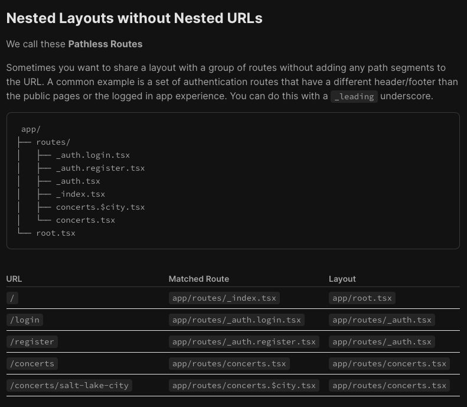
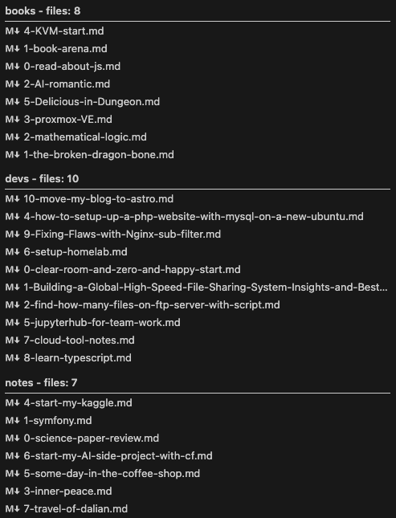

## 前言

经过多次纠结，我的网站终于成功更新到astro。具体到到所花费的时间上，学习astro相关文档，跟着教程做花了1周左右，然后把之前网站的文件迁移过来，又花了3天，这样我的新版网站至少在2024年5月底成功更新了。

## 更新前后的对比

如果对比hexo和astro，我其实没有什么太多可说的，因为两个我都不是非常了解，虽然[旧博客](http://history.oldyang.site)使用的hexo很久，但是我自己只是换了两次模板，然后也没有实际做过什么修改。

如果从个人感受来说，hexo扩展修改起来真的比较麻烦，感觉没有很好的教程，比如，再多次考察hexo作为cms主力框架学习和使用的过程中，完全没有成功的开发过他的theme。另外，最终迁移的时候，我发现因为许久没有更新，我居然完全无法更新我的博客了。虽然可能是我到处写博客造成的，不过，icarus主题作为一个子项目存在的方式管理起来太繁琐了。

相比较来看，astro的教程真的是太友好了，跟着教程做下来，稍稍改动一些地方就得到了我现在使用的这个博客了。整个开发过程使用的技术栈工具都很新，用起来也非常顺手开心。令人心动的点在于，稍稍改动一点一切都会顺利，即使是不顺利的时候（比如：把post变量传递给组件，组件中使用的是posts，这种）也会有详细的报错。想起了之前[symfony](/symfony)开发的经历。工具非常详细。

## 让我看中的杀手功能

astro这次更新给我动力的点感觉有两个：一是可以自定义文件名，另一个是开发标准化。

我的文章的磁盘md文件希望可以按照某种顺序排序，比如，可以按照发布顺序。虽然，我知道这个功能严格来说应该使用某种管理工具来实现（我现在用的vscode+frontmatter），实际操作起来我用了一个前缀的方式，这个方式短暂解决了我的问题，但是这个前缀会出现在文章的URL中，就很不优雅。

[https://history.oldyang.site/2024/04/20/9-Fixing-Flaws-with-Nginx-sub-filter/](https://history.oldyang.site/2024/04/20/9-Fixing-Flaws-with-Nginx-sub-filter/)

这个链接就是如此。数字“9”感觉比较碍眼，可是我又想文件好好排序。另外，分类也是个问题，为了处理好分类，我甚至在数字前面又加了一个前缀，这样就更难受了。工作中学习remix.run的时候，我发现它的文件名路由可以通过简单的一个"_"前缀来忽略部分文件名，从而让逻辑上相关的模块自然的排列在一起。

虽然最终没有使用remix，最终的方案，我用astro的collection机制和自己自定义的一个path字段来解决了以上问题。这样我就可以自己任意指定友好的url地址了。感觉是一种暴力解决方式，没有约定配置那么精巧，但是也收获了第二个有点。

第二个让我开心的地方是，我现在的工作目录是一个标准的node项目的目录了。astro作为一个基础框架，大部分东西我都可以自己实现，感觉项目干净清洁了不少，至少每个部分的功能都知道了。可以在astro的基础上自己做点东西，或者就简单的好好写一些文章也是不错的。

## 新博客的更新计划

看看日期，这次断更时间也是非常的长（仔细看了一下，好像也就一个月，并不很长，嘻嘻）。其实这个月看了一些书的，《精通Python爬虫框架Scrapy》、《React设计原理》、《大模型应用开发极简入门》这么三本书，另外实践也并不少，还有很多想法。

用备忘录多记录一些想法，等静下心来的时候就多输出吧。
