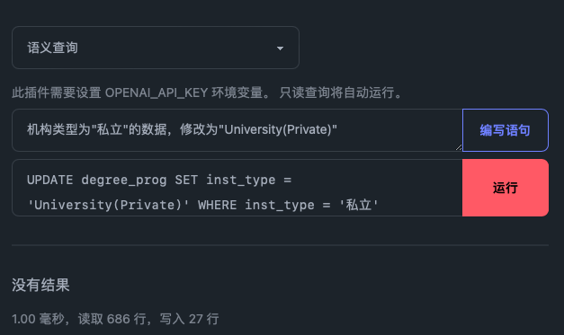

## 前言

小型的RAG(Retrieval-Augmented Generation)应用可以帮助各类文档检索更加实用话，具有非常广泛的应用场景。本文尝试基于cloudflare构建一个小型RAG应用,充分利用cloudflare平台的易用性和易于触达的特性，帮助开发更快的构建MVP(Minimum Viable Product)应用。

## 项目背景

随着GPT系列模型应用的传播和应用，LLM模型已经站展现出了极强的应用落地能力。在很多情况下可以辅助完成很多编程工作、数据处理等。比如，根据自然语言生成SQL语句用于完成数据库任务。

## 网络环境

开发网络环境的应用还是非常繁琐的，网速慢还有各种意外。但是cloudflare可以让一个网站或者服务长期在线没有成本实在是太棒了。
