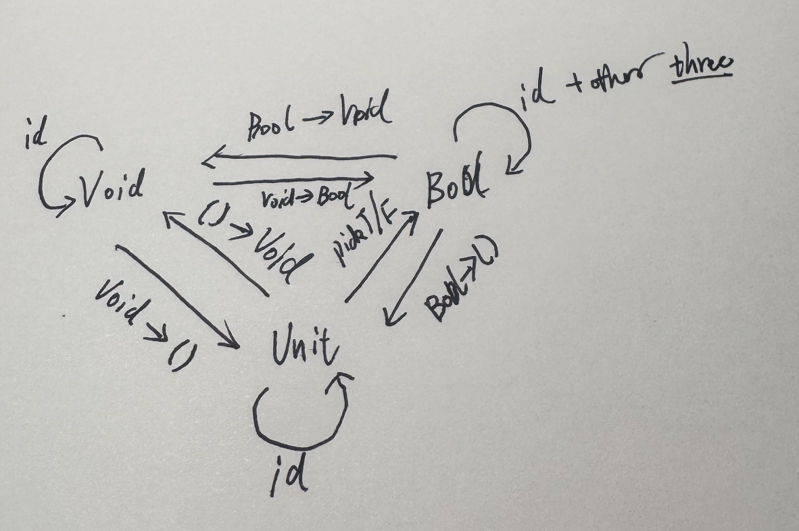

## 前言

非常有幸的利用假期时间阅读《Category Theory for Programers》，并且非常幸运的找到了一个非常棒的中文翻译，虽然只有第一部分,但是依然让我有了非常好的切入视角。看完了（第一部分）第一遍之后，我找到了原作者的视频，并尝试看翻译的第二遍，为了加深学习并做好记录，也许在不久的将来，我可以更加深入的理解Monad，并且可以写出更好的程序。也借用这里好好地记录整理一下相关链接。

## 相关资源

首先是[原始博客](https://bartoszmilewski.com/2014/10/28/category-theory-for-programmers-the-preface/)，这个是作者原文，然后就是我参考学习的中文翻译汇总：

- [<译> 写给程序猿的范畴论 · 序](https://segmentfault.com/a/1190000003882331)
- [<译> 范畴：复合的本质](https://segmentfault.com/a/1190000003883257)
- [<译> 类型与函数](https://segmentfault.com/a/1190000003888544)
- [<译> 范畴，可大可小](https://segmentfault.com/a/1190000003894116)
- [<译> Kleisli 范畴](https://segmentfault.com/a/1190000003898795)
- [<译> 积与余积](https://segmentfault.com/a/1190000003913079)
- [<译> 简单的代数数据类型](https://segmentfault.com/a/1190000003943687)
- [<译> 函子](https://segmentfault.com/a/1190000003954370)
- [<译> 函子性](https://segmentfault.com/a/1190000003993662)
- [<译> 函数类型](https://segmentfault.com/a/1190000004631638)
- [<译> 自然变换](https://segmentfault.com/a/1190000012381561)

感谢[garfileo](https://segmentfault.com/u/garfileo)的翻译，至少第一部分可以有非常精良的翻译，我把链接放在这里，作为一个目录索引方便学习查阅。

另外，我发现一个很好的思路，虽然概念很难很艰涩，但是只要不停的学习总能一点点的加深理解。学习中间会遇到一种困难，明明资料就在那里，并且作者以为他已经讲明白了，但是就是没有看懂，也很难看懂（比如，我在做第四章习题的时候就碰到了理解困难），这时怎么办呢？一个好办法是多看各种资料！每个人的切入点是不一样的，描述方式也不一样，这样总会在某个上下文中了解某个细节，这些细节的拼接就能慢慢还原原理的全貌了。从开阔的视野看，我了解haskell这个语言本身是不是就提供了一个让我重新审视“数学”，再次喜欢“数学”的视角呢？那我写下的这篇文章是不是也可能为别人提供一个“视角”？这样考虑，我是否不用太纠结“对错”？更加一般的，“兼听则明”是否就是学习行为的一般性呢？

感悟完，这里记录一些有用的资料，还是得慢慢看、慢慢学。首先是《同构》这本书可以再看一遍，或者至少在这里记录一下，还有没有看完的[数理逻辑书](/mathematical-logic-reading-notes/)，完成笔记。另外就是一些公开的资料：

- 知乎的内容非常接地气，伴随不同视角，描述角度众多->[怎么理解“一个单子（Monad）说白了不过就是自函子范畴上的一个幺半群而已”?](https://www.zhihu.com/question/282666729)
- 我学习kaskell就是读完了这本，长度刚刚好，具体的语言给我提供了理解函数编程和范畴论的路径->[haskell趣学指南](https://learnyouahaskell.mno2.org)
- 从js角度学习函数式编程，从事后来说这是个“伪捷径”，这个不适合“入门”，直接学习haskell看似麻烦其实是捷径，但是，如果深入理解之后再看这个，非常适合作为应用的例子看，嗯，这个不长->[mostly-adequate-guide-chinese](https://github.com/llh911001/mostly-adequate-guide-chinese)
- 一个完整的单子实现，英文的，但是例子非常详细->[The State monad:A thorough guide to fp-ts's State monad.](https://paulgray.net/the-state-monad/)
- 这是一个刚刚搞懂的人提供的视角[详解函数式编程之 Monad](https://netcan.github.io/2020/09/30/详解函数式编程之Monad/)

---

## 课后挑战部分

提示：*这些答案是我自己的学习记录，不保证正确哦*

### 范畴：复合的本质

>1.用你最喜欢的语言（如果你最喜欢的是 Haskell，那么用你第二喜欢的语言）尽力实现一个恒等函数。

```Rust
fn id<T>(x:T) -> T {x}
```

>2.用你最喜欢的语言实现函数的复合，它接受两个函数作为参数值，返回一个它们的复合函数。

```Rust
fn compose<A,B,F,G,T>(f: F, g: G) -> impl Fn(A) -> T
where
    F: Fn(B) -> T,
    G: Fn(A) -> B,
{
    move |x| f(g(x))
}
```

>3.写一个程序，测试你写的可以复合函数的函数是否能支持恒等函数。

```Rust
fn main() {
    fn add_one(x: i32) -> i32 {x + 1}
    let f = compose(add_one, id);
    assert_eq!(6, f(5));
}
```

>4.互联网是范畴吗？链接是态射吗？

很棒的问题，第一反应:"是的",文章是对象，链接是态射,从一篇文章跳转到另外一篇文章。但是仔细思考发现问题不对，一个链接并没有包含起点信息，只是可以指向一个终点，一篇文章包含链接可以理解为他是起点吗？换个角度思考，链接可以复合吗？感觉链接不能复合，两个链接的复合一定是后一个链接指向的内容，那么这个复合操作是个很奇怪操作，倒是复合结合律……如果把整个互联网想象成一个对象，那么这些链接是不是态射呢？感觉也不太对……总结，感觉不是范畴，或者说不是某种一般的范畴，如果是，也应该是某种特殊的范畴吧。

>5.脸书是一个以人为对象，以朋友关系为态射的范畴吗？

不是。朋友关系不能复合，朋友的朋友可以不认识。

>6.一个有向图，在什么情况下是一个范畴？

任意两个对象都两两联通的情况应该是一个范畴了，当然，每个节点还有个环指向自己。

### 类型与函数

>1.用你最喜欢的语言，定义一个高阶函数（或函数对象）memoize。这个函数接受一个纯函数f，返回一个行为与f近乎相同的函数g。但是g只是第一次被调用时与f的功能相同，然后它在内部将结果存储了起来，后续再用同样的参数调用它，它只返回自己存储的那个结果。你可以通过观察f与g的运行效率来区分它们。例如，让f是一个需要耗费挺长时间才能完成计算的函数，这样，当第一次调用g的时候，它会运行的很慢，但是用同样的参数对g再次调用，则可以立即得到结果。

```Rust
use std::hash::Hash;
use std::collections::HashMap;
use std::rc::Rc;
use std::cell::RefCell;
fn memoize<F, A, R>(f: F) -> impl Fn(A) -> R
where
    F: Fn(A) -> R,
    A: Eq + Hash + Clone,
    R: Clone,
{
    let cache: Rc<RefCell<HashMap<A, R>>> = Rc::new(RefCell::new(HashMap::new()));
    move |arg: A| {
        let mut cache = cache.borrow_mut();
        if let Some(result) = cache.get(&arg) {
            return result.clone();
        }
        let result = f(arg.clone());
        cache.insert(arg, result.clone());
        result
    }
}
fn slow_function(x: i32) -> i32 {
    // 模拟一个耗时的计算
    std::thread::sleep(std::time::Duration::from_secs(2));
    x * x
}
fn main() {
  let memoized_slow_function = memoize(slow_function);
    // 第一次调用，应该会比较慢
    println!("Result: {}", memoized_slow_function(4)); // 计算并缓存结果
    // 第二次调用相同的参数，应该会很快
    println!("Result: {}", memoized_slow_function(4)); // 直接返回缓存结果
    // 不同的参数，应该会比较慢
    println!("Result: {}", memoized_slow_function(5)); // 计算并缓存结果
}
```

>2.标准库中用于生成随机数的函数，能够被memoize么？

不能，没有参数。

```Rust
    let mut rng = rand::rng();
    use rand::Rng;
    let n = rng.random::<u32>();
    println!("n = {}", n);
```

>3.大多数随机数生成器都能够用一个种子进行初始化。请实现一个能够接受种子的函数，这个函数可将种子转交给随机数生成器，然后返回所得结果。这个函数能被memoize么？

可以。

``` Rust
    fn generate_random_number(seed:[u8;32]) -> u32 {
        use rand::SeedableRng;
        use rand::rngs::StdRng;
        let mut rng = StdRng::from_seed(seed);
        rng.random::<u32>()
    }
    println!("n:u32 with seed [0;32] = {}", generate_random_number([0;32]));
    let memoized_generate_random_number = memoize(generate_random_number);
    println!("memoized_generate_random_number n:u32 with seed [0;32] = {}", memoized_generate_random_number([0;32]));
```

>4.下面的 C++ 函数，哪一个是纯的？试着去 memoize 它们，然后多次调用后看看会发生什么：能被 memoize 还是不能。

```C++
(1) 文中的阶乘函数。
(2) std::getchar()
(3) bool f() {
    std::cout << "Hello!" << std::endl;
    return true;
    }
(4) int f(int x){
    static int y = 0;
    y += x;
    return y;
    }
```

只有(1)是纯函数，其他的都存在副作用，无法被缓存。

>5.从 Bool 到 Bool 的函数有多少中？你可以将它们都实现出来么？

一共有4种。

```Rust
fn always_true(x: bool) -> bool {true}
fn always_false(x: bool) -> bool {false}
fn not_function(x: bool) -> bool {!x}
fn identity_function(x: bool) -> bool {x}
```

这里有个动手才能发现两个微妙的事实：

1. identity_function和identity函数应该是等价的；
2. 虽然函数确实是只有四种(2^2)，但是，函数的调用却存在8种情况，如下：

- always_true(true): true
- always_true(false): true
- always_false(true): false
- always_false(false): false
- not_function(true): false
- not_function(false): true
- identity(true): true
- identity(false): false

>6.将Void，()（unit）以及Bool作为对象，将与这些类型相关的所有函数作为箭头，你能画出一个范畴么？用函数名来标注箭头。

这个问题初步看非常困扰我，但是我感觉又非常重要。absurd函数是无法调用的，但是这个函数不存在吗？这个态射本身应该是存在的吧。结合对于集合的理解，Void对应的应该是空集，如果没有空集出发的态射显然是不合理的，因此，应该是考虑他们之间的态射。我能想到的结果如下：


