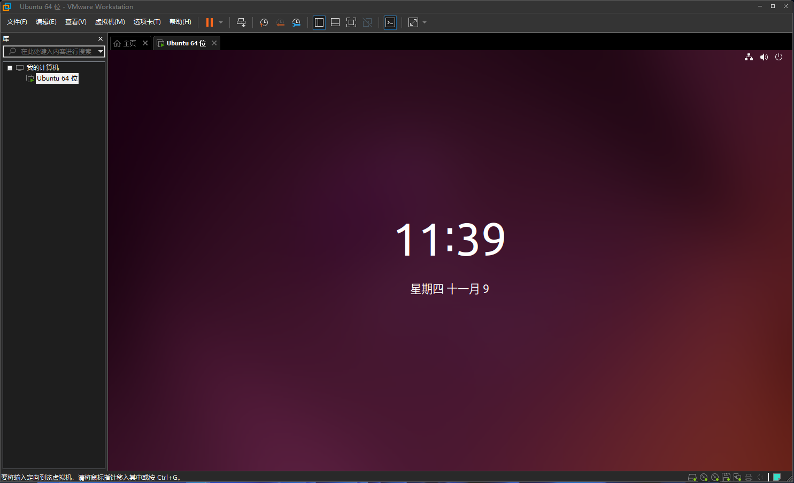
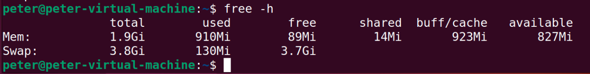
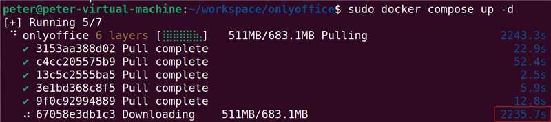
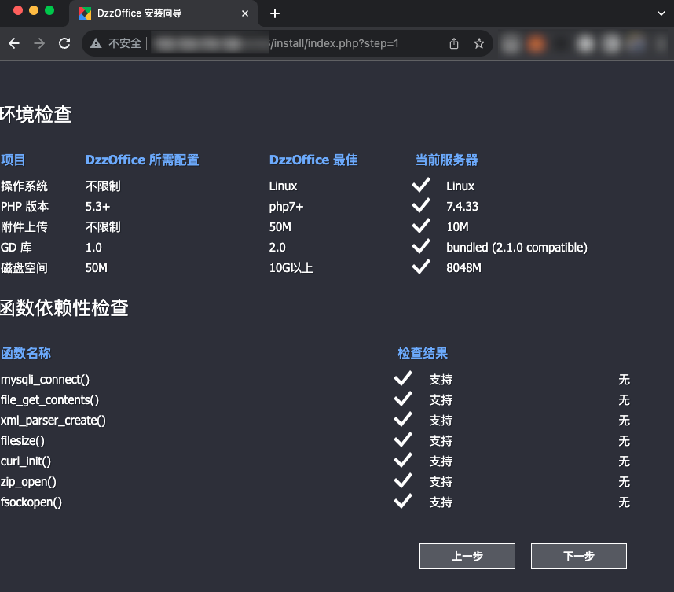
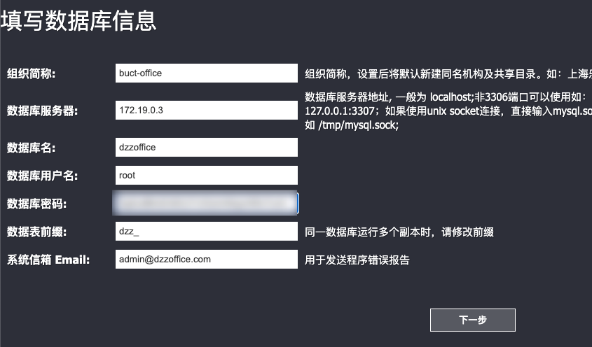

## 前言

很久没有写教程了。
其实日常写的东西并不少，但是我的博客还是断更了，距离上次写内容一个月以上了，这一个月的生活变化、人际关系变化特别多，总的来说：一切在客观上更加顺利了。
写下这篇教程的时间，我有非常多的想法，但是要把想法落地落实，却又需要很多的时间和精力，本着尽量留下痕迹的方式，如果要写就尽量留下公开的痕迹吧，本着这样的思路写下这篇php网站的部署博客。

## 环境部署

第一步是安装ubuntu，有一个可以部署应用的系统。由于本文撰写的时间，我选择了ubuntu 22.04(友人推荐的长期支持版)，至于ubuntu的安装这里不在赘述。



### 设置swap

新的机器，最好设置一下swap防止内存不足，我的机器是2g，设置4g的交换空间应该就足够了。
相关脚本如下：

``` bash
sudo swapon --show #查看是否设置了交换空间
sudo fallocate -l 2G swapfile #创建交换文件
# sudo dd if=/dev/zero of=/swapfile bs=1G count=2 #fallocate不可用时采用这个命令
sudo chmod 600 swapfile #设置文件权限
sudo mkswap swapfile #创建交换文件
sudo swapon swapfile #启用交换文件
echo "/swapfile none swap sw 0 0" | sudo tee -a /etc/fstab #添加内容到启动项中
free -h #检查是否成功
```

我的系统是使用虚拟机安装的，一开始就被设置好了交换分区了。



### 安装docker

第一步，肯定是安装docker，虽然整个网站是使用的php，不过，数据库最好还是容器化比较简单，安装docker按照教程来就可以。[Install Docker Engine on Ubuntu](https://docs.docker.com/engine/install/ubuntu/),这是安装教程链接，使用过多次，每次都很顺利。

卸载旧版本：这个命令是卸载旧版本用的，如果没有安装旧版本，可以不用这个。

``` bash
for pkg in docker.io docker-doc docker-compose docker-compose-v2 podman-docker containerd runc; do sudo apt-get remove $pkg; done
```

设置docker的库,设置好docker软件库，为下载做准备

``` bash
sudo apt-get update
sudo apt-get install ca-certificates curl gnupg
sudo install -m 0755 -d /etc/apt/keyrings
curl -fsSL https://download.docker.com/linux/ubuntu/gpg | sudo gpg --dearmor -o /etc/apt/keyrings/docker.gpg
sudo chmod a+r /etc/apt/keyrings/docker.gpg

# Add the repository to Apt sources:
echo \
  "deb [arch="$(dpkg --print-architecture)" signed-by=/etc/apt/keyrings/docker.gpg] https://download.docker.com/linux/ubuntu \
  "$(. /etc/os-release && echo "$VERSION_CODENAME")" stable" | \
  sudo tee /etc/apt/sources.list.d/docker.list > /dev/null
sudo apt-get update
```

安装docker,并进行测试安装效果

``` bash
sudo apt-get install docker-ce docker-ce-cli containerd.io docker-buildx-plugin docker-compose-plugin

sudo docker run hello-world
```

### 安装openoffice

最好给openoffice单独建立一个目录，这样使用compose可以直接部署openoffice服务。
使用docker compose来部署openoffice服务

``` yaml
version: "3"

services:

  onlyoffice:
    container_name: oo7
    image: onlyoffice/documentserver:7.4.1.1
    ports:
      - "9000:80"
    restart: always
    environment:
      - JWT_SECRET=<yourkey>
```

当然可以使用命令解决以上问题：**！！！注意，yourkey需要修改！！！**

``` bash
mkdir -p ~/workspace/onlyoffice
cat <<EOF | tee ~/workspace/onlyoffice/docker-compose.yaml
version: "3"

services:

  onlyoffice:
    container_name: oo7
    image: onlyoffice/documentserver:7.4.1.1
    ports:
      - "9000:80"
    restart: always
    environment:
      - JWT_SECRET=<yourkey>
EOF

sudo docker compose up -d #下载镜像，启动服务
```

如果想停止服务，可以使用一下命令 ``` sudo docker compose down ```

[http://localhost:9000](http://localhost:9000),可以通过这个网址查看是不是部署成功了。

onlyoffice的镜像可能很大，可以把镜像提前准备好来节省实际部署时候的时间.

``` bash
sudo docker images #这个命令查看镜像，找到要导出镜像的id
sudo docker save 0fdf2b4c26d3 > oo7.tar #导出镜像文件，其中参数就是镜像id
sudo docker load < oo7.tar #导入镜像
```



这里还有一个细节：下载好的镜像，可以放在一个公开的服务器上（比如放到对象存储上），这样用wget下载速度就快了。例子：```wget https://www.example.com/directlink/bj/webs/oo7.tar```

这里的细节其实很多，因为虚拟机是NAT模式联网，我通过web界面把文件上传到了服务器上。这时候发现如果我当初安装的server版，没有gui，那么这个工作还非常难以实现呢。虽然就算有GUI，也是因为我有自己的文件中转服务才能简单实现。


### 部署php环境

然后就是部署php环境的阶段，虽然按照正常流程是php、mysql、nginx这样依次安装，但是这样效率太低了，这里还是推荐用docker安装。使用[docker-lnmp](https://github.com/ogenes/docker-lnmp)项目来进行php网站的配置，部署和后续迁移都会方便。

如果以dzzoffice项目的安装为例子，把源代码放到默认的www目录中，目录结构如下：

``` bash
|____docker-lnmp
| |____nginx
| |____php74
| |____php81
| |____php73
| |____php72
| |____php71
| |____mysql
| |____php80
| |____php56
| |____redis
|____www
| |____static
| |____misc
| |____install
| |____user
| |____config
| |____dzz
| |____core
| |____data
| |____admin
```

``` bash
find . -name "._*" -print ## 检查缓存文件
find . -name "._*" -delete ## 清除缓存
find ./ -mindepth 1 -maxdepth 2 -type d | sed -e 's;[^/]*/;|____;g;s;____|; |;g' 确认目录结构，如上图
cd docker-lnmp #来到环境目录
cp .env.example .env #创建配置文件
sed -i 's/NGINX_HOST_HTTP_PORT=.*/NGINX_HOST_HTTP_PORT=8086/' .env #替换其中的某些配置，比如，设置端口
docker network create backend --subnet=172.19.0.0/16 #关键步骤，为容器应用创建子网络
docker network ls | grep backend
docker compose up -d nginx php74 mysql #启动应用，这个命令会非常慢，可以尝试配置docker源的方式加速
# echo '{"registry-mirrors":["http://hub-mirror.c.163.com"]}' | sudo tee /etc/docker/daemon.json
# systemctl restart docker
# docker info #查看配置结果
# #在Dockerfile中的apt也可以配置更新源来加速，在apt-get update之前添加一行命令就可以了
# RUN sed -i s@/deb.debian.org/@/mirrors.aliyun.com/@g /etc/apt/sources.list
# #sed格式如下
# sed '/^RUN apt-get update/ i\
# RUN sed -i s@/deb.debian.org/@/mirrors.aliyun.com/@g /etc/apt/sources.list
# ' Dockerfile


docker compose restart nginx #修改配置后启动某些容器

sudo sh -c "cat <<'EOT' > ./docker-lnmp/nginx/conf.d/default.conf
server {
    listen 80;
    server_name     localhost 127.0.0.1;

    root /var/www;
    index index.php index.html;

    charset utf-8;
    default_type text/html;

    location / {
        try_files \$uri \$uri/ /index.php\$is_args\$args;
    }
  include conf.d/fpm/php74-fpm;
}
EOT" #设置
```

上面的脚本细节特别坑，sh和cat会对 $ 解释两次，所以要用两次防止过滤的方式。

然后安装php网站会碰到以下错误：`Host '172.19.0.74' is not allowed to connect to this MySQL server`
参照这个[解决思路](https://blog.csdn.net/mazaiting/article/details/106661158)可以通过更改访问权限来解决问题。

进入容器：`docker compose exec mysql mysql -u root -p`,
执行命令：

``` sql
show databases;
use mysql;
select host,user from user; --查看用户权限配置
update user set host = '%' where user ='root'; --开放外部连接
flush privileges; --更新权限
```

然后就可以安装任意的php网站了，为了在网速“不快”的服务器上，可以利用`docker save -o myimages.tar image1:tag1 image2:tag2` 把多个镜像导出到一个文件，这样就可以整体搬家了。

### bonus 配置部署包

网站在后期开发中可能需要添加扩展，扩展要通过composer安装。这样的情况目标机器上还是需要安装php，不同的系统不一样。[rocky9.3参考这里](https://www.linuxcapable.com/how-to-install-php-on-rocky-linux/)。

``` bash
sudo dnf config-manager --set-enabled crb
sudo dnf install \
    https://dl.fedoraproject.org/pub/epel/epel-release-latest-9.noarch.rpm \
    https://dl.fedoraproject.org/pub/epel/epel-next-release-latest-9.noarch.rpm
sudo dnf install dnf-utils http://rpms.remirepo.net/enterprise/remi-release-9.rpm -y #key cmd line

dnf module list php
sudo dnf module enable php:remi-7.4 -y
```

当然还有个apt的例子。

``` bash
sudo apt-get update
sudo apt -y install software-properties-common
sudo add-apt-repository ppa:ondrej/php
sudo apt-get update
sudo apt -y install php7.4
```

然后就是安装[composer](https://getcomposer.org)了,为了部署方便，安装在本地就可以。

``` bash
php -r "copy('https://getcomposer.org/installer', 'composer-setup.php');"
php -r "if (hash_file('sha384', 'composer-setup.php') === 'e21205b207c3ff031906575712edab6f13eb0b361f2085f1f1237b7126d785e826a450292b6cfd1d64d92e6563bbde02') { echo 'Installer verified'; } else { echo 'Installer corrupt'; unlink('composer-setup.php'); } echo PHP_EOL;"
php composer-setup.php \
php -r "unlink('composer-setup.php');" \
php composer.phar require casdoor/casdoor-php-sdk #安装sdk的例子
```

**新的问题**配置到这里，虽然一切看似正常了，不过curl可以正常访问casdoor，可是php却提示缺少证书。这个时候才发现，证书是被配置在docker里的！因此，证书要暴露给docker……真的是复杂啊。

进入docker，[参考这个文档](https://blog.csdn.net/yimuta9538/article/details/118695201)可以临时更新证书。

``` bash
sudo docker exec -it <container_id_or_name> bash
## update certificates
```

## **特别注意**

如果修改了.env一定要重新rebuild，env的参数进入dockerfile是build时发生的。

``` bash
docker compose down
docker compose up -d --build mysql nginx php74
```

## 新的问题

mysql可能会出现“Restarting (1) Less than a second ago”不断重启，这时可以用logs命令查看问题所在。

```sudo docker logs container_id```

## 具体例子dzzoffice部署

通过以上部署，dzzoffice网站就可以安装了,<http://ip:port/install/index.php>这个网址是固定安装目录。








网站运行起来了，然后就是设置，第一项是把onlyoffice配置好，在线浏览文章的功能是必要的。


然后一个可以共享文件的小平台就建立好了。

## Troubleshooting

使用文中的docker脚本，有时候再第一次配置错误的情况下，会产生“奇怪的跳转”，比如，访问<http://127.0.0.1:8086>会强制跳转到<http://127.0.0.1>，经过多次测试，发现这是“客户端”的某种“记忆”。解决方式也很简单，对于safari浏览器，可以把对应域名的缓存删除掉。对于Edge、chrome等浏览器，使用开发者模式，在”网络选项卡“上把”禁用缓存“勾选上，然后再访问一次这个网页就能把缓存遗忘了。

## 鸣谢

特别鸣谢我的妻子，她帮我写了一个小的手册文章，所以我有时间精力写下这篇教程。
