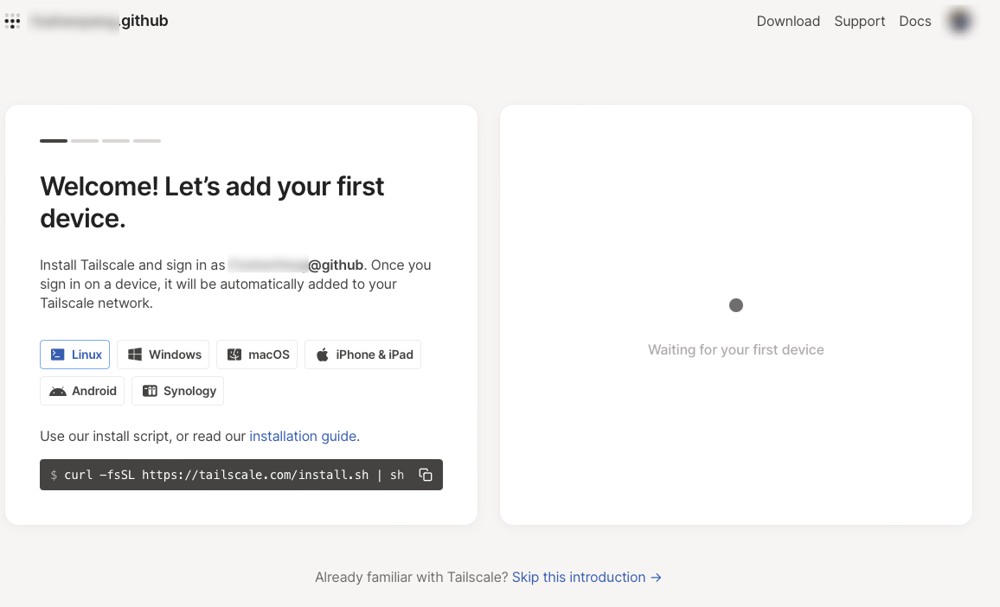
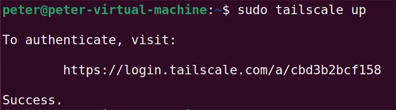
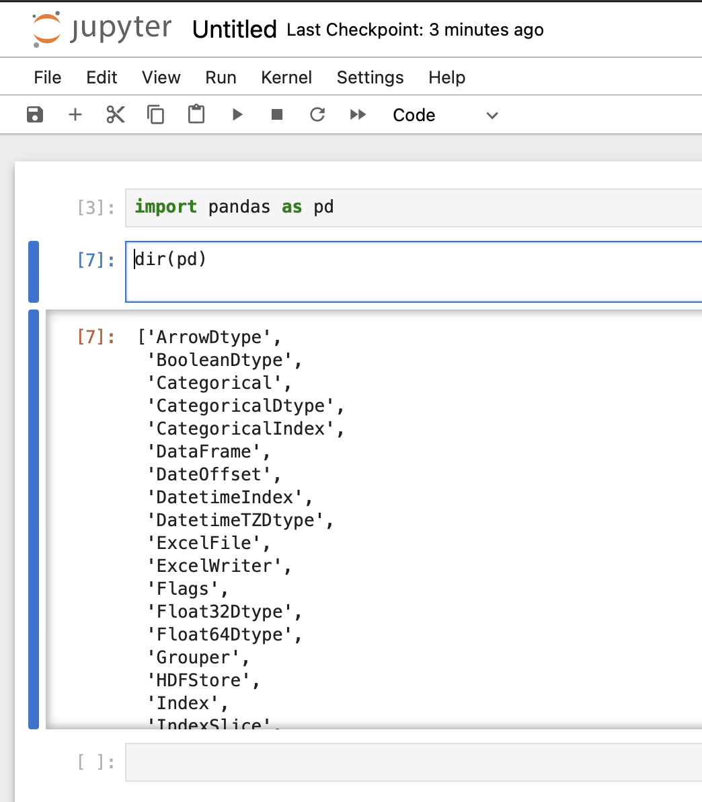
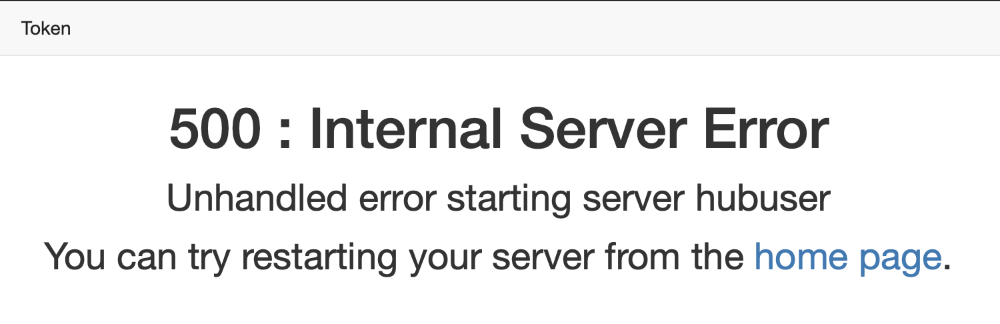
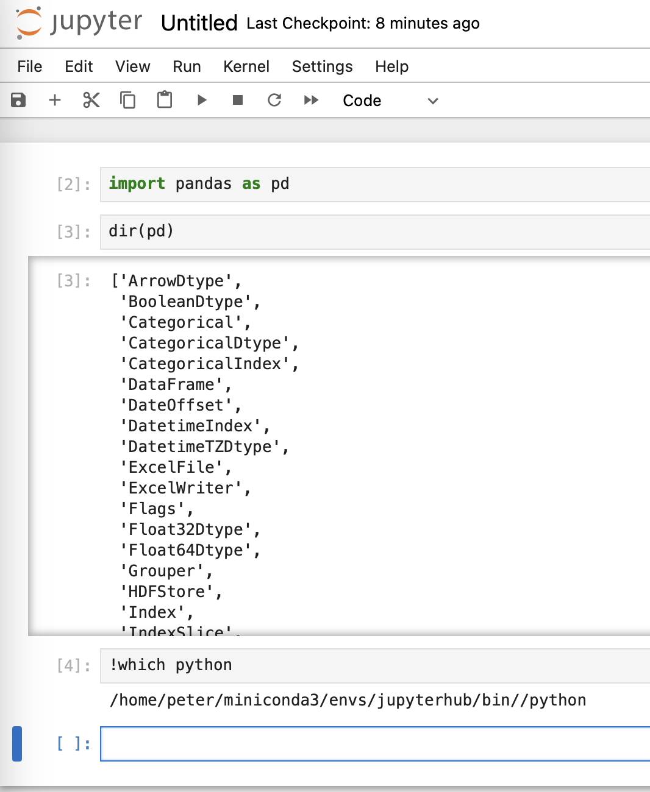
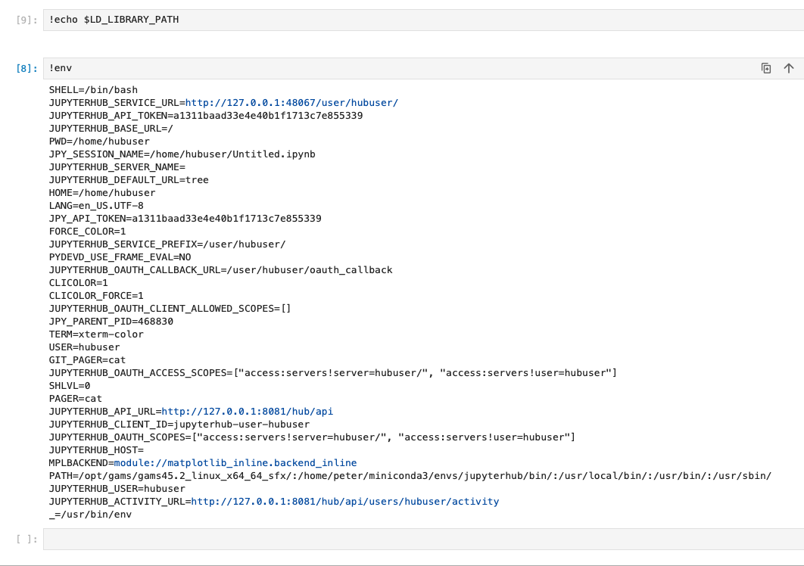

## 前言

python统一环境从来都是一个复杂的问题，特别是要多人合作的时候（甚至两个人合作要统一环境也经常出问题）。环境配置不一致很容易打击团队的积极性，让本来应该聚焦到具体问题解决上的注意力被分散。晚上有很多教程，都是只是讲某个技术细节的配置，很少有完整的方案。本教程详细介绍一下如何配置一个帮助管理员或者小组领导带领小队完成数据分析任务的jupyterhub环境，包括环境安装、用户配置等诸多细节。

## 内网穿透

是的，从内网穿透开始讲，太多的教程都会忽略服务最终如何访问到的问题，好像所有人都有了很好的网络环境，实际上的情况往往很复杂，很多新手可能就被“卡”在这里。当然，本教程也忽略了操作系统的安装这个步骤，尽量做到取舍有度。

假设你已经有了一台可以上网的ubuntu主机，本教程是基于一台NAT模式的虚拟Ubuntu进行的。登录tailscale的官网，找到对应的安装命令。



``` curl -fsSL https://tailscale.com/install.sh | sh ```
相关的详细教程可以在官网查到[https://tailscale.com/download/linux](https://tailscale.com/download/linux),官网贴心的附带了分步骤安装教程。


其实只是需要下载一个25MB的包，因为网络的原因，这个步骤我失败了很多次。原因是tailscale的服务器在境外。如果能有一个安装了科学透明代理的网络环境，这类服务安装起来会简单很多，等后续的教程中我在补这部分吧。



启动的命令是： ```tailscale up```

这里有个小提示：命令行给出的地址，并不需要一定要“本机”登录，实际上我用我的笔记本电脑访问了图上的地址，完成了验证。

下一步我在macbook上安装tailscale终端，就可以进入虚拟的内网，访问服务器了。跨区原因不能在应用商店安装，用brew安装也很方便。

```bash
brew install tailscale #安装tailscale
sudo tailscaled install-system-daemon #启动为系统服务
#sudo tailscaled uninstall-system-daemon #这个命令应该是注销系统服务
tailscale up
tailscale ip #查看ip地址
tailscale status #查看设备情况
```

启动服务就可以把终端和服务器放在一个内网里了，这样可以随时访问到NAT中的虚拟服务器了。
我的教程这里相当于一个例子，如果你使用的是不同设备，官网有详细的教程，链接在这里[安装终端的链接](https://pkgs.tailscale.com/stable/)

本教程重点在于全面细节，为了能够随时访问到该机器，自然还要在机器上安装sshd服务，命令如下：

``` bash
sudo apt install ssh
sudo systemctl ssh
```

然后，使用你自己习惯的ssh终端，通过tailscale服务的内网地址，就可以访问到服务器了。
这里有个个人碰到的小提示：我在tailscale使用中，有时明明服务在线，但是却访问不到主机，此时我发现使用ipv6就可以轻松访问到主机了。

## 安装conda

第一时间找到官方教程总是不会错的[Miniconda](https://docs.conda.io/projects/miniconda/en/latest/)，根据教程可以完成安装。

官方的教程如下：

```bash
mkdir -p ~/miniconda3
wget https://repo.anaconda.com/miniconda/Miniconda3-latest-Linux-x86_64.sh -O ~/miniconda3/miniconda.sh
bash ~/miniconda3/miniconda.sh -b -u -p ~/miniconda3
rm -rf ~/miniconda3/miniconda.sh
```

以下教程均是按照官方脚本执行之后配置。不过，这里强烈建议不要完全按照官方教程来做，原因见后面章节。如果你能把教程全部看完之后再操作，建议把minicoda安装在/opt/miniconda/。

安装好之后，记得运行`~/miniconda3/bin/conda init bash`这个命令把miniconda加入到环境变量里,然后重新登录一下就激活了conda的base环境了。

## 安装jupyterhub

虽然也有非常方便的tljh安装方式。实际落地的话，下载tljh特别考验网络速度，完全没有conda来的快捷，另外使用conda安装更好定制，所以，这里推荐用conda来安装jupyterhub。

```bash
conda create -n python310 python=3.10 #创建基础环境
conda create -n jupyterhub --clone python310 #根据基础环境创建jupyterhub环境
#这里提供一些可能会用到的管理命令
#conda env remove --name jupyterhub #适当的时候可以删除环境
#conda env list #现实当前的环境列表
conda activate jupyterhub #激活环境
#conda search -c conda-forge nodejs --info #找到允许的版本列表
conda install nodejs #安装node
npm install -g configurable-http-proxy #这个可以安装代理服务
python3 -m pip install jupyterhub jupyter notebook #这个可以顺利安装notebook
#如果网速过于慢，可以试试国内的源
#pip install jupyterhub jupyter notebook -i http://pypi.douban.com/simple/ --trusted-host pypi.douban.com
```

经过上面的操作，jupyterhub已经装好了，可以尝试启动jupyterhub了。

``` bash
mkdir ~/jupyterhub #创建用来放置jupyterhub的目录
cd ~/jupyterhub/
jupyterhub --generate-config #会生成配置文件模版
jupyterhub -f jupyterhub_config.py #运行jupyterhub,这个命令一般也用来测试jupyterhub文件
```

如果一切正常访问<http://ip:8000>这个地址就可以看到jupyterhub界面了，然后就是把jupyterhub配置的可用。
这里特别提示一下，jupyterhub默认使用的是linux系统本身的用户账户系统，用户名和口令就是linux系统本身的用户名和口令，新建用户也是同理。

## 配置jupyterhub

配置jupyterhub也是很重要的一环，基本而言就是围绕配置文件进行；不过在那之前可以考虑先把内核配置好。

```bash
pip3 install ipykernel
python3 -m ipykernel install --name=jupyterhub --display-name "dev_default"
#jupyter kernelspec list #列出kernel
#jupyter kernelspec uninstall jupyterhub #卸载kernel
pip install -i https://pypi.tuna.tsinghua.edu.cn/simple pandas # 安装一个包看看虚拟环境中的包是否在kernel中生效
```

两个心得：

1. 因为使用jupyterhub环境安装的jupyterhub（怎么读着那么绕……），所有jupyterhub再后来的子用户就默认都具有jupyterhub这个虚拟环境，安装kernel至少在这里并不是必须的（更绕了），但这里还是提一下，如果想给所有用户都配置可选的kernel意外的困难，毕竟jupyterhub就装在jupyterhub虚拟环境下（……）；
2. `pip -i`参数可以加快安装速度，另外也不用额外的更改源，意外的好用。



```jupyterhub_config.py```文件中写入如下内容

``` python
c.JupyterHub.admin_users = {'peter'}
c.Spawner.default_url = 'tree'
c.LocalAuthenticator.create_system_users = True
```

以上命令分别是设置默认界面、设置管理员、设置添加用户方式等等，这个方面可以参考文档，当然直接阅读`jupyterhub --generate-config`命令生成的模版学习如何配置也是非常棒的。学习的重点就是更改一些配置，然后用命令直接运行看看结果。很多问题是在使用中发现的，比如现在jupyterhub添加用户是会报错的。


这个报错是我意料中的，原因自然是权限不足，目前普通账户无法创建用户。（意料中出错，然后修正，有点测试驱动的意味在里面呢）。为了解决以上问题，同时也是为了方便日常管理jupyterhub服务，把这个注册为系统服务。

``` bash
which jupyterhub #这个命令确定Environment的目录

#这段脚本根据你自己的情况改一下再用
sudo sh -c "cat <<EOT > /etc/systemd/system/jupyterhub.service
[Unit]
Description=JupyterHub

[Service]
User=root
Environment=PATH=/home/peter/miniconda3/envs/jupyterhub/bin/:/usr/local/bin/:/usr/bin/:/usr/sbin/
ExecStart=/home/peter/miniconda3/envs/jupyterhub/bin/jupyterhub -f /home/peter/jupyterhub/jupyterhub_config.py

[Install]
WantedBy=multi-user.target
EOT"
#以上命令是以root用户安装conda为例子进行的

sudo systemctl daemon-reload
sudo systemctl start jupyterhub
sudo systemctl enable jupyterhub
sudo systemctl status jupyterhub
#sudo systemctl restart jupyterhub
#sudo systemctl disable jupyterhub
#sudo systemctl stop jupyterhub
#sudo journalctl -u jupyterhub -n 50 #这是查看日志的命令
```

这样整个jupyterhub就配置好了。再次尝试添加用户，成功添加。

然后用管理员登录，给这个用户设置一个密码`sudo useradd -m -s /bin/bash hubuser && sudo passwd hubuser`，用户就可以登录了，然后我们就看到了错误。



这是说明一开始就配置错误了，conda被安装在了用户目录下，新添加的用户完全访问不到。等于是官方教程的`mkdir -p ~/miniconda3`这个命令开始就出错了，应该把miniconda安装在/opt里才比较合适，事到如今，只能尝试修复一下权限了。

```bash
sudo -u hubuser /home/peter/miniconda3/envs/jupyterhub/bin/jupyterhub-singleuser -h
chmod 755 ~/home/peter/
```

提示：如果有机会重新配置conda，一定要安装在/opt目录。



虽然配置工作很辛苦，不过至少环境可以统一了，如果用户多一点（也不需要特别多，节约的精力依然可观），使用conda在对应虚拟环境下安装的包都可以让所有用户共享。对于某些的特定的共享文件，可以放在共享系统库目录中共享,`python -c "import sys;print(sys.path)"`命令输出的地址都可以放置共享文件。另外对于，需要使用ctypes.cdll.LoadLibrary函数加载的模块，系统会寻找LD_LIBRARY_PATH设置的目录，对于systemd，设置两个节点就可以了。

``` bash
#这是配置例子，实际测试过并没有成功
[Service]
Environment="PATH=/usr/local/bin:/usr/bin:/bin"
Environment="LD_LIBRARY_PATH=/opt/gams/"
```



需要在jupyterhub_config.py文件中配置保留哪些环境变量[参考链接](https://github.com/jupyterhub/jupyterhub/issues/2630)。

``` python
c.Spawner.env_keep = ['LD_LIBRARY_PATH','PATH', 'PYTHONPATH', 'CONDA_ROOT', 'CONDA_DEFAULT_ENV', 'VIRTUAL_ENV', 'LANG', 'LC_ALL', 'JUPYTERHUB_SINGLEUSER_APP']
```

我们来捋一下环境变量的传递：首先系统运行bash的时候会加载用户自己和系统通用的环境变量->conda环境会激活部分环境变量->systemd的unit文件忽略系统变量，可以自己设置->jupyterhub要设置过滤哪些，默认继承的环境变量里没有LD_LIBRARY_PATH。感觉就是个环境变量的传递游戏。


## 用户目录配置

`sudo mkdir share && chmod 777 share/`首先建立一个目录供所有人共享使用。

建立起基本的目录结构
`mkdir pub codes project`

通过以下方式可讲目录的权限给到任意用户。

``` bash
cd /var/share/project/
mkdir 01-notebooks
sudo su
chmod 777 01-notebooks
cd /home/hubuser/
ln -s /var/share/project/01-notebooks 01-notebooks
```

通过以上设置，就可以使用linux的权限管理机制来管理用户的文件了。

## gams安装

[这是安装文档](https://www.gams.com/45/docs/UG_UNIX_INSTALL.html)

[这个可以用来参考在虚拟环境中安装gams](https://www.gams.com/latest/docs/API_PY_GETTING_STARTED.html)

安装gams其实比想的要简单，只要按照文档把gams解压，并配置好环境变量就可以了。

对于jupyterhub的情况，在systemd的注册脚本中，在`Environment`配置节点，把gams所在的目录添加进去，就可以完成配置了。本教程主打一个详细，看到无数教程都写如何配置，但是最重要的其实是怎么确定配置好了。这里提供gams的例子：

``` bash
sh -c "cat <<EOT > ~/example.gams
Sets
     i   canning plants   / seattle, san-diego /
     j   markets          / new-york, chicago, topeka / ;

Parameters

     a(i)  capacity of plant i in cases
       /    seattle     350
            san-diego   600  /

     b(j)  demand at market j in cases
       /    new-york    325
            chicago     300
            topeka      275  / ;

Table d(i,j)  distance in thousands of miles
                  new-york       chicago      topeka
    seattle          2.5           1.7          1.8
    san-diego        2.5           1.8          1.4  ;

Scalar f  freight in dollars per case per thousand miles  /90/ ;

Parameter c(i,j)  transport cost in thousands of dollars per case ;

          c(i,j) = f * d(i,j) / 1000 ;

Variables
     x(i,j)  shipment quantities in cases
     z       total transportation costs in thousands of dollars ;

Positive Variable x ;

Equations
     cost        define objective function
     supply(i)   observe supply limit at plant i
     demand(j)   satisfy demand at market j ;

cost ..        z  =e=  sum((i,j), c(i,j)*x(i,j)) ;

supply(i) ..   sum(j, x(i,j))  =l=  a(i) ;

demand(j) ..   sum(i, x(i,j))  =g=  b(j) ;

Model transport /all/ ;

Solve transport using lp minimizing z ;

Display x.l, x.m ;
EOT"
```

以上是官方例子的模型，在用python调用。

``` python
from gams import GamsWorkspace
import os
ws = GamsWorkspace()
job = ws.add_job_from_file(os.getcwd() + "/example.gams")
job.run()
for rec in job.out_db["x"]:
    print(f"x({rec.key(0)},{rec.key(1)}): level={rec.level} marginal={rec.marginal}")
```


## 小结

至此，一个小型的可多人共享的jupyterhub配置好了，团队需要共享的代码可以放到share目录中，权限根据linux系统的权限来管理。对于管理员来说，需要进行的操作无非就是如下几种：

1. 创建用户，并设置密码以及忘记密码时重置密码
2. 维护项目目录的文件内容
3. 把目录挂载给指定用户，并设置适当的权限
4. 删除用户的权限或者不允许其再看到对应的目录
5. 给虚拟环境安装适当的软件包

以上就是管理员所有操作的枚举，只要管理员熟悉了以上操作，就可以让团队利用好jupyterhub顺利推进工作啦。
