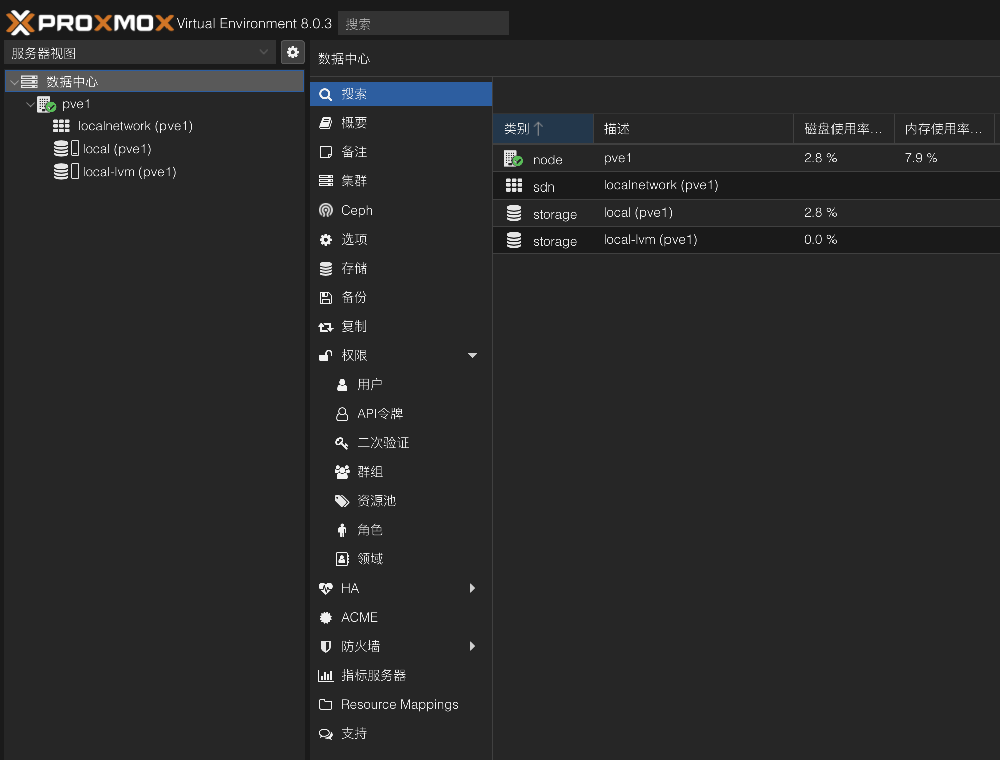
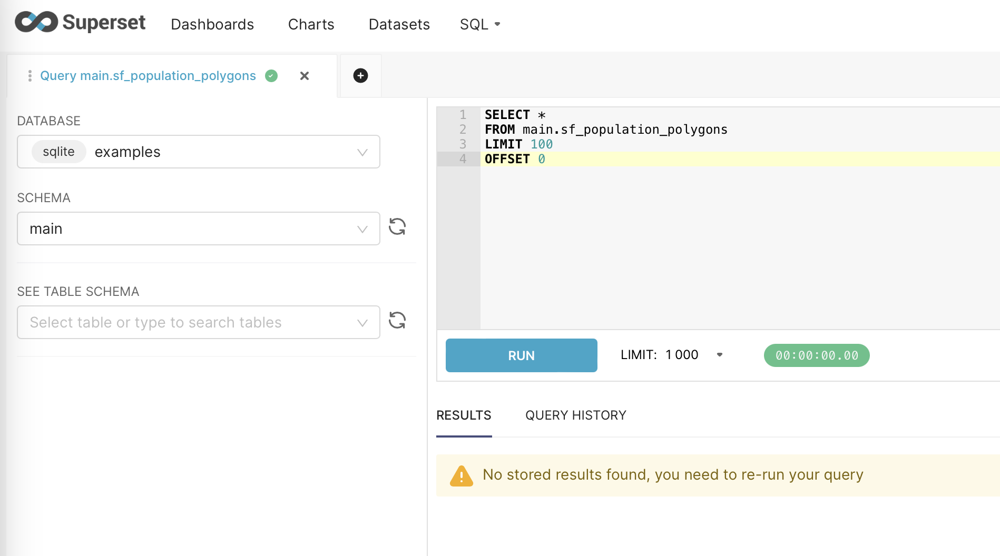
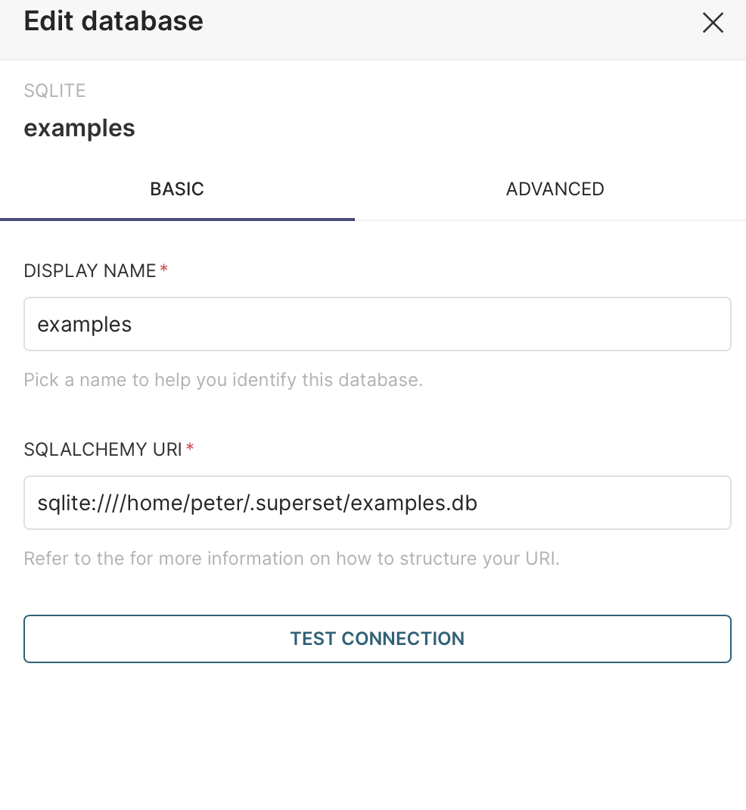

---

title: 随着假期开始的充电——搭建自己的homelab
description: ''
pubDate: 2024-01-13T18:10:02
tags: ["HomeLab","Tutorials"]
slug: setup-homelab
author: 'Fushen YANG'
---

## 前言

假期屯了不少书，准备给自己一个充实的假期。好多东西想学习，airflow、superset、scrapy等，另外还想学习rocky linux，还有之前的kvm和pve的内容也想巩固。为了想法落地考虑利用时间搭建自己的homelab。


另外，我终于有机会把这个学期学的内容进行实践了，目前的规划是给旧笔记本安装fedora，给小mini主机安装pve。新的小mini主机就作为服务器使用了。

fedora的安装还是很简单的，调整一下AHCI就能找到硬盘了。可是即使如此我也安装了两遍。问题出在密码上，新安装之后密码无法进入，第二次安装的时候注意到了原来是输入密码的时候输入法是大写状态。DELL电脑的win系统开机就会风扇狂转，现在安装了fedora之后，变得特别安静（下载软件的时候还是会有一点点声音）。

## 然后就是重新搭建基础

家里的旧电脑有点多了，显示器只有一台（多了桌子也放不了），要让我的mac重新能支持双屏幕估计要等到下次升级了。经过多次思考后决定让mini主机安装PVE：
第一点，如果我用fedora服务器，每次还要安装sshd和vnc，考虑到这麻烦情况，还不如直接用http控制电脑；
第二点，考虑到要做的本地项目组件众多已经有点复杂了，越早熟悉虚拟化平台能够越早启动项目。
第三点，如果可以把远程开发环境搞好，以后就有了坚实的homelab基础了。

## 安装PVE

长时间的调研准备，开始工作居然拖了这么久。这里要说一下，全新的mini主机自带win11 pro，什么都还没有安装开机风扇就想个不停，虽然我现在不能明确问题所在，不过，这个情况让我对win依然是不太有好感。

先不要考虑ip地址的设置，一把点安装。PVE安装时间意外漫长，检查了一下，居然卡在了“create LVs 3%”，没有想到一开始就这么不顺利。[也有提示说不用管它，这是正常现象](https://forum.proxmox.com/threads/proxmox-installation-stuck-on-3-creating-lvs-please-help-guys.94650/)，果然多等了一会儿，后面安装就非常快了。安装成功了，然后就是要考虑ip地址接入的问题了，找根网线把机器接入到网络中，修改interface文件和hosts文件，把ip地址设置到静态。

``` bash
vi /etc/network/interfaces
vi /etc/hosts
systemctl restart networking
reboot
```



安装操作系统的时候意外顺利。


一天下午的时间，我就安装了pve,fedora,rocky linux，感觉是挺充实的，并且由于之前阅读的关系，kvm的书籍让我重新理解了网络的模型，可以在配置上更加得心应手。


``` bash
sudo dnf install qemu-guest-agent
sudo systemctl start qemu-guest-agent
sudo systemctl enable qemu-guest-agent
sudo systemctl status qemu-guest-agent
```


创建好base镜像，系统配置乱了随时回来。

## 修正系统时间

既然要折腾，就肯定有小修小补，比如，发现时间错误了，要改一下时间。pve的时间是错误的，而虚拟机的时间是正确的（date -R）。[先尝试用hwclock解决了](https://www.tugouli.cn/3642.html)，一个有意思的现象，根据命令行修改时间之后，我的登录直接退出了！应该是系统根据这个时间判断登录时间的，非常透明和“干净”的感觉!查了一些文档，果然如果条件允许的话还是试试ntp服务吧。

## 安装fedora服务器

把dell xps改装成了小型服务器，合上盖子不休眠真的很容易配置。

``` bash
sudo vi /etc/systemd/logind.conf
    change #HandleLidSwitch=suspend
    to HandleLidSwitch=ignore
sudo systemctl restart systemd-logind.service
```

然后就是配置虚拟机和插件：

``` bash
dnf install cockpit-navigator cockpit-machines
dnf install qemu-kvm libvirt libvirt-daemon virt-install virt-manager libvirt-dbus
sudo dnf install podman
```

一个小型的服务器也准备好了，至此我的书架上有了linux、macos、win三个小型的环境，另外还有个pve主机可以一步一步继续学习了。

## 安装airflow

开始安装体验，官方的文档有很详细的安装教程，不过我还是想先从podman开始。

``` bash
dnf install podman
podman pull apache/airflow
podman run -d -p 8080:8080 airflow
#安装并启用端口
sudo firewall-cmd --list-all
sudo firewall-cmd --zone=public --list-ports
sudo firewall-cmd --zone=public --add-port=8080/tcp --permanent
sudo firewall-cmd --reload
sudo firewall-cmd --zone=public --list-ports
```

并没有成功，`podman ps`发现容器退出了，使用`podman logs -l`返回的内容居然是“airflow command error”，不得不说，非常诡异。最后尝试使用helloworld测试一下podman是否装好。

``` bash
podman run hello-world
podman logs -l
```

看到输出的一瞬间我明白了。airflow的错误输出正是由于logs命令运行正常，是我没有对airflow做正确的配置。这个错误虽然很小，但是也非常有趣，容器内部和外部环境形成了“隔层”，但是内部程序是不知道的，他努力的发出声音也是因为没有配置好，但是这个声音的渠道被我听到了，是不是就构成了一种“穿透”。形式上就是，我输出podman日志的预期看到了容器的日志，从而担心整个podman环境出现了什么问题。我觉得这也是奎因第二类问题的一种体现。

如果用容器运行airflow不是最默认的方式肯定是有原因的，尝试没有配置好的话，就按照[最默认的方式来吧](https://airflow.apache.org/docs/apache-airflow/stable/start.html)。

干净的系统居然没有pip，需要自己安装`python -m ensurepip --default-pip`。


基础硬件设施解决之后发现，其实很多开源软件直接安装即可，容器化并不能让每个问题都简单，甚至有时在不熟悉的情况下会复杂化。

## 安装superset

这次学老实了，先跟着[教程](https://superset.apache.org/docs/installation/installing-superset-from-scratch/)走。superset感觉是个“纯”的python包，如果考虑后续使用，也许可以借鉴一下jupyterhub的安装经验。

配置防火墙启动：`superset run -h 0.0.0.0 -p 8088 --with-threads --reload --debugger`

启动之后发现无法登录，依然是仔细看日志，然后在[社区找到处理方案](https://github.com/apache/superset/issues/24579),这里提一下，这个社区的处理方案，提问人提问的方式太棒了非常详细。最终采用了两个配置建议（包括“TALISMAN_ENABLED”），最终见到了欢迎页面。中间一度很多错误，让我转向了docker部署，不过最终还是解决了。（原因是忘记运行`superset init`命令了）



``` txt
[Unit]
Description=Superset Application

[Service]
User=peter
ExecStart=/usr/bin/bash /home/peter/superset/superset_run.sh

[Install]
WantedBy=multi-user.target
```

``` bash
source /home/peter/venv/bin/activate
export FLASK_APP=superset
export SUPERSET_CONFIG_PATH=/home/peter/superset/superset_config.py
superset run -h 0.0.0.0 -p 8088 --with-threads --reload --debugger
```

最后就注册成服务，可以随意使用了。其中有个点，如果User配置为root，账号密码不可用。这样让人非常在意账号密码存在哪里？还是说执行初始化的时候和用户关联了？



## 配置casdoor

嗯，突然配置这个东西，确实有些跳跃。不过类似于游戏技能树一样，这个模块配置好可以很大程度上解决登录问题。
首先，还是看看rocky上怎么安装docker吧，毕竟，podman还是有些问题，生产环境中docker用的更多一点。
经过测试，casdoor确实可以在内网部署https服务，使用acme.sh申请证书。

``` bash
sudo docker compose restart casdoor
sudo docker compose restart casdoor_proxy
```

配置这个重点是要生成证书，这样要学习一下acme.sh了。`curl https://get.acme.sh | sh -s email=fsy@gmail.com`
acme.sh结合cloudflare可以很容易的生成证书。主要都是证书的安装细节和注册脚本了。根据需要要安装cron:`sudo dnf install crontabs`

无论如何，安装sso的服务端都还是简单的，下一步就是考虑如何把用户端配置好，配置流程如下：

1. SSO_CLIENT_ID和SSO_CLIENT_SERCRET是在SSO服务端生成的；
2. 应用的实际生成地址需要提供给SSO作为callback;
3. 使用命令行注入ca.cer的位置；export NODE_EXTRA_CA_CERTS=/real/path/ca.cer;
4. 把sso中应用公钥的信息提供给应用。

注册到这里就出错了，node无法识别le的证书，本来node就没有le的证书，这里更换zerossl证书试试（之后依然要重新注入）。
最后还是选择了注册zerossl的账号，至此，我终于了解了证书的运作机制，并了解了acme.sh工具的使用。[可以参考的教程还是很多的](https://ffis.me/archives/2110.html).

经过一通操作，至少在自己的实验环境搞定了。然后把app和sso都准备一份部署工具，等完全部署好，就可以了。

其中使用一个fetch函数可以验证证书有没有配置好。

``` javascript
fetch('https://door.tcub.site')
  .then(response => response.text())
  .then(data => console.log(data))
  .catch(error => console.error(error));
//node test.js
```

node当然需要专门安装:

```bash
dnf module list nodejs
dnf module -y install nodejs:20/common
```

以casdoor为中心，就能很大程度上解决用户管理的问题了。

不过，casdoor的角色配置也是有技巧的，有两个问题要解决：

1. 如何限制用户的权限范围，比如只能登录指定应用；
2. 如果防止用户登录casdoor本身这个系统；
3. 如何使应用登录无缝化；

实际使用起来，还是有些注意事项的:

1. 如果防止应用用户和系统用户混乱（主要是昂志用户登录cas系统，这种情况下，需要建立新的组织，应用需要重新配置）；
2. 新建组织的情况下，只有组织中有应用的情况才能添加用户成功；

修改好了应用信息之后，需要重新发布一下就可以了。`docker build -t video:v7 .`

### troubleshoot

早起发现无法正常生成域名的证书，“明明昨天还是正常的呀”然后一看昨天的证书其实也是不正常的。却少必要的公共证书。经过一个小时的波折，冷静了下来，法相原来是dns_cf的key的问题。之前的key只是访问一个域名的（或者至少zone_id只能指向一个域名）。
zone_id可以在dns管理对应域名的信息页面找到。令牌的话，在个人信息（右上角）里：My Profile->API Tokens->use DNS:edit_template就可以获得了。

### troubleshoot 2

系统可能需要安装ca证书才能访问目标服务器，主要是使用[update-ca-certificates](https://www.cyberciti.biz/faq/update-ca-certificates-command-examples-in-linux-to-ssl-ca-certificates/)命令。[不同系统安装方式不一样](https://blog.csdn.net/SHELLCODE_8BIT/article/details/125250740)，这里记录一个ubuntu的例子。对于php74容器运行的php网站，需要进入容器更新证书才能实现sso通信。

``` bash
docker exec -i container_id bash #进入容器
ls -l /etc/ssl/certs/ #查看所有的证书所在目录，可以把证书拷贝到这个目录
vim /etc/ca-certificates.conf #把证书名字添加进去
sudo update-ca-certificates #更新证书
```

## 开始配置homelab

假期开始，终于有足够的时间配置属于我的homelab了，服务器也就位了。借助pve和cloudflare尝试构建homelab。之前我一直担心，cf的tunnel是不是不够快？现在想到我的homelab我突然明白了，如果我自己用就没有这个问题了。首先试试[authentik](https://goauthentik.io/docs/installation/docker-compose)

首先，尝试用podman部署一下authentik。`sudo dnf install podman`安装podman。然后就是一系列命令：

``` bash
sudo dnf install python3
sudo dnf install python3-pip
pip3 install podman-compose
sudo dnf install -y epel-release
sudo dnf install -y pwgen
```

使用podman失败了，但是不清楚可能的原因，所以，还是老老实实装docker吧。

``` bash
sudo dnf remove docker docker-client docker-client-latest docker-common docker-latest \
  docker-latest-logrotate docker-logrotate docker-selinux docker-engine-selinux docker-engine
sudo dnf -y install dnf-plugins-core
sudo dnf config-manager --add-repo https://download.docker.com/linux/centos/docker-ce.repo
sudo dnf install docker-ce docker-ce-cli containerd.io docker-compose-plugin
sudo systemctl start docker
sudo systemctl enable docker.service
```

根据教程进行安装到是很快，利用cf的tunnel也很容易把服务发布出去，不过证书和配置应用搞不好就没有那么简单了。毕竟这个compose文件都没有看太懂。
自己的小homelab运行一两天就会发现进程号到了几十、几百万，估计还是哪里有泄漏。果然很多事情是自己实践之后才能发现的。

有了自己的homelab之后发现vscode更加好用了，然后再次意识到，还是使用证书访问更加方便。

``` bash
ssh-keygen -t rsa -b 4096
ssh-copy-id -i ~/.ssh/id_rsa.pub user@192.168.1.1 //for linux client
type $env:USERPROFILE\.ssh\id_rsa.pub | ssh user@192.168.1.1 "mkdir .ssh && cat >> .ssh/authorized_keys" // for win
```

## node网站镜像化

一个简单的node网站，是用的时候确实有问题的情况，直接发布镜像会方便一些，但是网站在使用了prisma的orm之后就需要在发布前建立数据库。建立数据库可能会用到的一些脚本如下：

``` bash
npx prisma db push
```

## ubuntu系统的磁盘管理

ubuntu默认安装的情况下会使用lvm，当然lvm不是问题，但是他会预留太多空间，导致默认的硬盘很容易就满了。这个时候就可以通过[调整磁盘](https://4sysops.com/archives/extending-lvm-space-in-ubuntu/)获得空间。

``` bash
sudo df -Th
sudo vgdisplay # or sudo vgs
sudo lvdisplay
sudo lvextend -l +100%FREE -r /dev/ubuntu-vg/ubuntu-lv
```

总体来说，lvm还是提高了整体的灵活性。

## 建立首页

终于来到了首页阶段，到目前为止，homelab的服务和连接已经非常多了，如果能有一个好的首页就好了，先动起来，随手找到了一个[首页](https://gethomepage.dev/latest/installation/docker/)项目，先把各种连接汇总吧。经过考虑zfile和authentik也许可以发布出去，其他的服务暂时还是放到家庭内网里比较好，必要的时候可以通过蒲公英访问。最终效果很好～可以非常方便的整理常用的访问链接了。

## 小结

随着第一天来到办公室，我也意识到假期结束了～买的很多书都没有看～不过我的homelab建设倒是很成功了。有个让我欣慰的点，我看到remix.run框架来到了2.7了，非常快的速度！感觉2.0还在昨天，新的开始加油～
