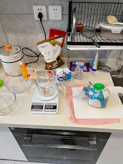

## 学习的背景

感谢我的妻子来到我的生活，她真的是非常有智慧的女性，我感觉治愈了有点点在低谷的我。
在她的鼓励下，我重新开始看kaggle，居然顺利学完了所有的入门课程，现在开始关注一些比赛。
我的工作推进虽然缓慢，不过我内心平静了很多，感觉可以慢慢推进做一些事情了，虽然现在，偶尔还是很困并且容易劳累，也许我该健身一下。
又是个碎碎念的博客呢。
生活的中的细节多了，我目前也能静下来了，和形而上学和解了，未来也许可以写出来不错的文章。

放张图记录一下最近的生活吧～

## 相关信息

[原文地址：开始了我的kaggle学习](https://yangfs.blogspot.com/2022/04/kaggle.html)
