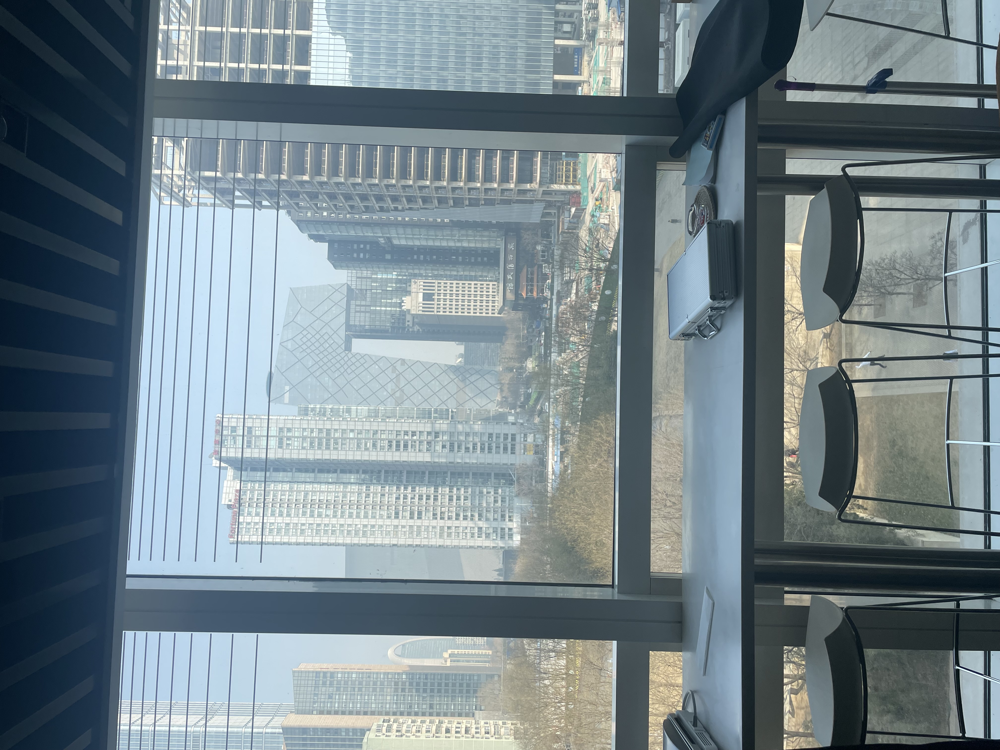
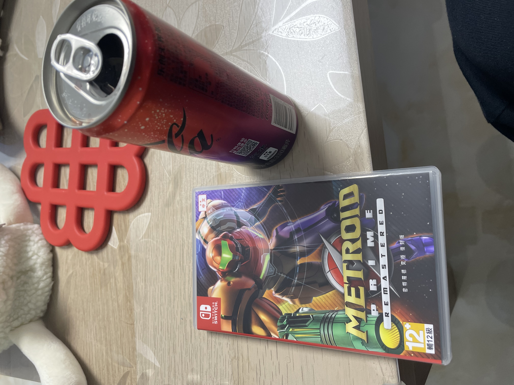

## 在一个咖啡厅重启了博客

感觉每次写下博客总是在“重启”……都是更换平台，或者间隔好久，希望能把这次更换平台算到最后一次。

## AI学习开始了

一年前，我在kaggle上学习课程，同样是一年前，我开始学习react，如果回顾一下过去，我发现自己依然是“乱冲乱撞”。不过，确实收获了很多内容，这些学到的东西也许哪天能发挥作用。比如，了解了ts，发现了几乎是我梦寐以求的编程语言，顺路也了解了函数式编程。

另一个好消息是，2023年年初，AI应用爆发了，也许是个新的机会，如果我能抓住或者至少能利用起来就好了。依然希望我的未来能有更好的故事。

## 家里的好消息

Rain考上大学了，真的是非常好的消息，全家人都开心。终于体会到那种我还把她当小姑娘但是其实已经是大孩子的感觉了。再有4年，小Rain也毕业了，那会儿会怎么样呢？3月的最后一天知道这个消息的，就把这天当作纪念日吧。

## 生活中充满了小惊喜

生活中的小惊喜总是不断出现，比如，去买个蛋糕碰到了过家家的联名。

虽然，有时下雨不过总有开心的事情，对了，在妻子的帮助和鼓励下，我开始准备发展一些副业，也许这是新的难以想象的神奇经历的的开始。

学校的面条意外的好吃，吃了好多天，我还开玩笑的封这个面条为“天下第一面”，想起来去年的时候，想吃都吃不到。如果要说什么是小确幸的话，这个面条当之无愧吧。

## 找到了好玩的游戏

买了《密特罗德究极重制版》，真的想把这种感觉记录下来。

游戏中的氛围非常有沉浸感，不断的升级、跑路、探索，果然是经典，能相遇太好了。目前游戏还没通关，准备单开一篇聊聊感受。
